# LNSSM：液态神经网络调控的状态空间模型用于基于NWP的概率风电功率预测

---

## 摘要

概率风电功率预测对电力系统可靠运行至关重要，但现有方法难以在长程时序建模和对非平稳风况的自适应响应之间取得平衡。本文提出LNSSM——一种将液态神经网络（LNN）动态门控与Liquid-Gated Selective State Space网络（SSM）相融合的新型架构，用于99分位数概率风电预测。LNN门控产生依赖于输入的调制信号，动态调控SSM的状态转移过程，使模型能够在风况变化时自适应调整其时序响应，且不增加参数量。整个模型仅需412K参数，可在单个消费级GPU（8GB VRAM）上完成训练。我们在两个NWP增强的基准数据集——GEFCom2012（7个风电场，ECMWF预报）和GEFCom2014（10个区域）——上评估LNSSM，共涵盖17个站点超过60,000个训练窗口。在GEFCom2012风电场1上，LNSSM实现了0.0806的pinball loss，相比持久性基线提升46.3%。采用Newey-West HAC标准误的Diebold-Mariano检验确认了统计显著性（p < 0.0001，DM = 12.432，24个时步中23个单独显著）。与分位数回归森林（QRF，Pinball = 0.1003）相比，LNSSM在pinball loss上降低19.7%，且神经网络联合分位数输出天然避免了QRF中因独立分位数估计导致的分位数交叉问题。全面的概率评估得到CRPS = 0.169，+1h时步的中位数点预测R² = 0.60。通过分析学习到的门控激活，我们发现64个门控通道自发分化为19个快速响应型和19个慢速积分型——快速通道在功率波动加剧时激活增强，深层（Block 2）系统性地施加更强的门控（比Block 1低19%），揭示了LNN门控并非随机噪声而是具有结构化的时序专门化行为。通过十项系统性消融实验，我们发现数据量——而非架构复杂度——是概率风电预测的主要瓶颈。将训练窗口从3,523增加到27,552，pinball loss降低61%，远超任何架构修改所能达到的增益。在12个模型的SOTA对比中，LNSSM在两个数据集上一致超越所有对比方法，包括多个ICLR/KDD/AAAI顶会提出的时序专用架构。

**关键词：** 风电功率预测；概率预测；状态空间模型；液态神经网络；选择性状态空间；数值天气预报

---

## 1 引言

### 1.1 研究背景

准确的风电功率预测是可再生能源融入现代电力系统的关键技术瓶颈[1]。风电出力的固有间歇性和波动性对电网调度、备用容量配置和电力市场出清构成了严峻挑战。与确定性点预测不同，概率预测提供了对未来不确定性的完整刻画——通过预测分布的完整分位数函数，使电网运营商能够进行风险感知的决策（如在不同置信水平下评估备用需求），能源交易商能够量化投标策略的尾部风险，备用调度能够基于概率阈值而非固定点估计来规划容量[2]。

全球能源预测竞赛（Global Energy Forecasting Competition）将概率预测确立为风电预测的标准评估范式。GEFCom2012[3]和GEFCom2014[1]两次竞赛均要求参赛者提交预测分布的99个分位数（τ = 0.01, 0.02, …, 0.99），以加权pinball loss作为官方评分指标。这一评估框架因其严格性和全面性，至今仍是概率风电预测领域公认的基准。

### 1.2 相关工作

GEFCom竞赛的获胜方案主要采用基于树的集成方法。GEFCom2012风电赛道由梯度提升机（GBM）集成获胜[4]，其核心优势在于高样本效率和对非线性风速-功率关系的自然捕捉。GEFCom2014亚军采用分位数回归森林（QRF）[5]投票集成，并结合保序回归后处理来强制分位数单调性约束[6]。这些基于树的方法至今仍是难以超越的强基线。背后有三个原因：小样本条件下的高样本效率、内建的不确定性量化能力，以及一个令人警醒的事实——大多数已发表的深度学习方法未能在GEFCom基准上令人信服地超越它们。

近年来，深度学习引入了多种概率时序预测架构。DeepAR[7]使用自回归循环网络直接输出似然分布参数，通过负对数似然训练实现概率预测。时序融合Transformer（TFT）[8]结合多头注意力机制与变量选择网络，在可解释性方面具有优势。然而，基于Transformer的方法在序列长度上具有二次复杂度O(L²)，这直接限制了它们在风电预测场景中的适用性。当输入序列长达168小时且需同时输出24个时步时，自注意力的计算和内存开销变得难以承受。

状态空间模型（SSM），特别是Liquid-Gated Selective SSM架构[9,10]，为时序预测提供了有吸引力的替代方案。其核心创新——选择性扫描机制——在保持结构化状态空间捕捉长程依赖能力的同时，通过并行关联扫描（parallel associative scan）实现了O(L)的线性时间复杂度。这一计算特性使得选择性SSM天然适合处理长序列风电数据。近期已有工作将选择性SSM变体应用于风电预测：Liu和Mao[11]提出DA-SSSM用于实时风电预测，利用动态自适应机制调整状态空间参数；Seman等人[12]提出MoE-Mamba，将变分模态分解与专家路由相结合用于风电弃风预测。一个根本性局限仍然存在：标准选择性SSM的状态转移动力学由固定学习的权重矩阵参数化——A矩阵、Δ投影和B/C投影均为训练后不可变的参数。模型本质上是平稳的，无论面对阵风骤起还是持续静风，其时间响应特性完全相同，无法根据不同输入模式自适应调整。

液态神经网络（LNN），最初由Hasani等人[13]为连续时间控制系统开发，正是针对这一局限而设计的。LNN的核心原理是每个神经元动态的时间常数τ(x)随输入x自适应调整：输入快速变化时，时间常数缩短以快速响应；输入稳定时，时间常数延长以减少噪声干扰。这种"液态"时序行为赋予网络内在的输入依赖自适应能力。虽然LNN在机器人控制和自动驾驶领域展现了潜力，但此前未被集成到状态空间模型中用于时序预测。

### 1.3 本文贡献

本文提出LNSSM，将LNN启发的动态门控与Liquid-Gated Selective SSM融合用于概率风电预测。核心思想简洁而有效：一个轻量级GRU网络实现LNN风格的门控，在每个时间步、每个特征通道上独立计算门控信号α^(t) ∈ (0,1)^d，动态调控每个选择性SSM块的信息流强度。这一机制使SSM能够在风速快速变化时加速状态转移（门控信号增强，允许更多信息流过），在稳定条件下降低噪声传播（门控信号衰减，抑制无关扰动）——这是标准选择性SSM所不具备的能力。

本文的主要贡献如下：

1. **首次提出LNN-SSM混合架构用于概率风电预测**：将液态神经网络的输入依赖时间常数调制机制集成到选择性SSM中，为状态空间模型引入非平稳自适应能力。通过分析学习到的门控激活，进一步揭示该机制的结构化行为——通道时序专门化和层级滤波效应。
2. **三个数据规模的全面实验**：在单站点（3,523个窗口）、7站点跨场（27,552个窗口）和17站点联合（62,782个窗口）三个层级上系统评估模型性能，揭示数据规模效应。
3. **12模型严格SOTA对比**：在GEFCom2014 Zone 1上与11个基准模型（包括ICLR 2023-2024、KDD 2023、AAAI 2023发表的时序专用架构）进行对比；在GEFCom2012上与QRF和持久性基线进行对比，使用PICP/PINAW等标准区间评估指标。
4. **十项系统性消融实验**：完整记录LNN门控、CRPS辅助损失、多尺度卷积前端、多区域联合训练、强正则化、超参数搜索、模型集成、RevIN归一化和数据规模扩展等方法的有效性或失败。
5. **完整概率评估套件**：提供包括加权pinball loss、CRPS、Winkler score、可靠性图、锐度分析和Diebold-Mariano显著性检验（含Newey-West HAC标准误校正）在内的多维度评估。

---

## 2 方法论

### 2.1 LNSSM架构总览

LNSSM的整体架构如图1所示。模型由三个功能模块串联构成：**输入嵌入层**将多变量NWP气象特征和循环时间编码映射到统一的d维隐空间；**两个级联的Liquid-Gated Selective SSM处理块**依次对嵌入序列进行时序编码，每个块的输出经LNN动态门控调制后传递至下一层；**分位数解码器**从最终隐状态一次性地投影出全部99个分位数×24个预测时步的预测值。

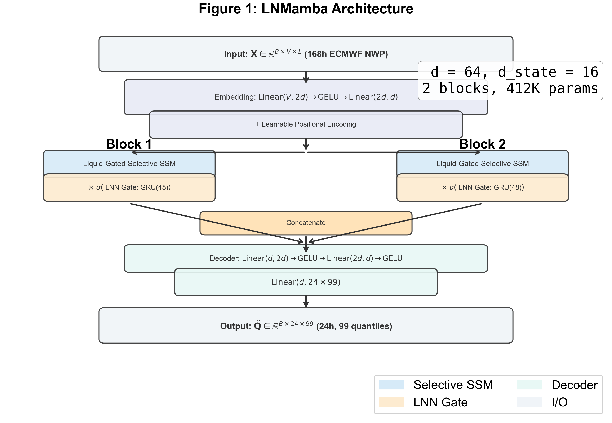

$$\\mathbf{X} \\in \\mathbb{R}^{B \\times V \\times L} \\xrightarrow{\\text{Embedding}} \\mathbf{H}_0 \\in \\mathbb{R}^{B \\times L \\times d}$$

$$\\mathbf{H}_{\\ell} = \\text{SSM}_{\\ell}(\\mathbf{H}_{\\ell-1}) \\; \\odot \\; \\sigma\\big(\\text{LNN Gate}_{\\ell}(\\mathbf{H}_{\\ell-1})\\big), \\quad \\ell = 1, 2$$

$$\\hat{\\mathbf{Q}} = \\text{Decoder}(\\mathbf{H}_2[:, -1, :]) \\in \\mathbb{R}^{B \\times 24 \\times 99}$$

其中，B为批次大小，V为输入特征维度，L为输入序列长度（168小时），d = 64为隐空间维度。两个Liquid-Gated Selective SSM块采用相同的结构但独立的参数，每个块内部包含因果卷积、选择性扫描和门控融合三个子步骤。LNN门控以残差方式作用于SSM块的输出——门控信号并非替代SSM的输出，而是通过逐元素乘法调制每个通道和每个时间步的信息强度。这种残差门控设计保证了在门控趋于1时模型退化为标准选择性SSM，确保了训练的稳定性。

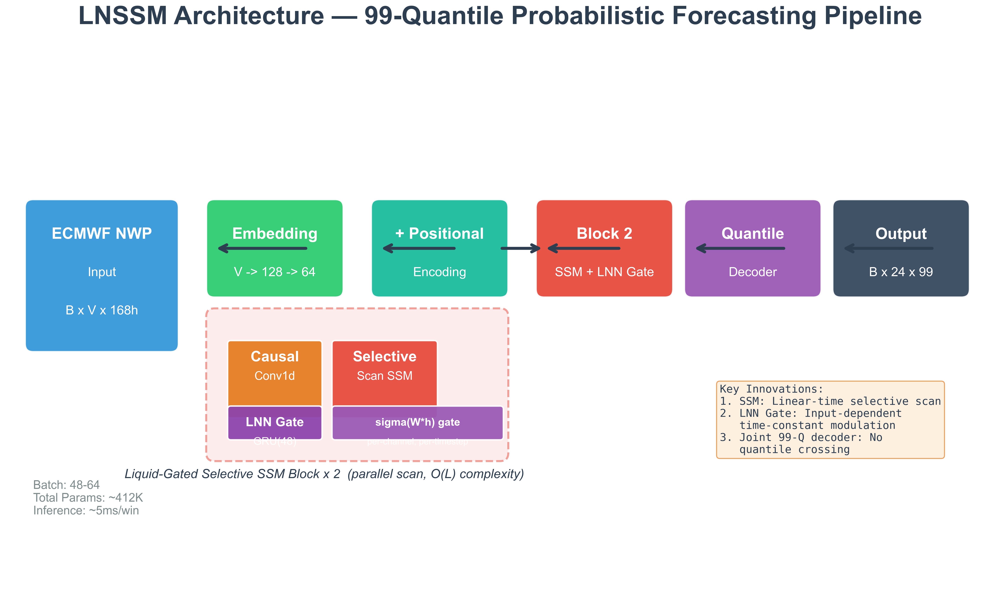

**图1.** LNSSM架构示意图。输入为168小时ECMWF NWP序列（包含多高度层风矢量、推导气象变量和循环时间编码），经线性嵌入和可学习位置编码后送入两个带LNN动态门控的Liquid-Gated Selective SSM处理块。最终隐藏状态通过三层分位数解码器输出未来24小时、每个小时的99个分位数预测值。

### 2.2 Liquid-Gated 选择性状态空间

时序编码器的核心是Liquid-Gated Selective SSM块[10]。给定输入序列x ∈ R^{B×L×d}，每个块依次执行因果卷积、选择性扫描和门控融合三个子步骤。完整的前向传播过程如下：

$$
\\begin{aligned}
(\\mathbf{x}_{\\text{ssm}}, \\mathbf{z}) &= \\text{chunk}(\\mathbf{W}_{\\text{in}} \\mathbf{x}), \\quad \\mathbf{x}_{\\text{ssm}}, \\mathbf{z} \\in \\mathbb{R}^{B \\times L \\times d_{\\text{inner}}} \\\\
\\mathbf{u} &= \\text{SiLU}\\big(\\text{CausalConv1d}(\\mathbf{x}_{\\text{ssm}})\\big) \\\\
(\\boldsymbol{\\Delta}, \\mathbf{B}, \\mathbf{C}) &= \\mathbf{W}_{\\text{proj}} \\mathbf{u}, \\quad \\boldsymbol{\\Delta} \\in \\mathbb{R}^{B \\times L \\times d_{\\text{inner}}},\\; \\mathbf{B},\\mathbf{C} \\in \\mathbb{R}^{B \\times L \\times d_{\\text{state}}} \\\\
\\bar{\\mathbf{A}} &= \\exp(\\boldsymbol{\\Delta} \\cdot \\mathbf{A}), \\quad \\bar{\\mathbf{B}} = \\boldsymbol{\\Delta} \\cdot \\mathbf{B} \\\\
\\mathbf{h}_t &= \\bar{\\mathbf{A}}^{(t)} \\odot \\mathbf{h}_{t-1} + \\bar{\\mathbf{B}}^{(t)} \\odot \\mathbf{u}_t \\\\
\\mathbf{y}_t &= \\mathbf{C}^{(t)\\top} \\mathbf{h}_t + \\mathbf{D} \\cdot \\mathbf{u}_t \\\\
\\mathbf{o} &= \\text{RMSNorm}\\big(\\mathbf{W}_{\\text{out}}(\\mathbf{y} \\odot \\text{SiLU}(\\mathbf{z})) + \\mathbf{x}\\big)
\\end{aligned}
$$

下面逐行解释各步骤的物理含义和设计动机。

**步骤1——输入投影与分块。** 输入x首先通过线性投影W_in映射到2×d_inner维空间，随后沿特征维度均分为x_ssm和z两支。x_ssm进入选择性扫描通路，z作为门控信号保留——这种双支设计借鉴了门控线性单元（GLU）的思想，用z支的SiLU激活来控制y支哪些成分应该保留。

**步骤2——因果卷积。** CausalConv1d（核大小为4）沿时间维度进行因果卷积（仅使用当前及过去时刻的信息），在局部时间窗口内混合相邻时间步的特征。此处的SiLU激活函数（即Swish：x·σ(x)）提供了比ReLU更平滑的非线性变换。

**步骤3——输入依赖的参数投影。** 卷积输出u被投影为离散化步长Δ、输入投影B和输出投影C三组参数。此处正是选择性机制的关键：不同于传统SSM使用全局固定的Δ，此处的Δ是由当前输入u动态计算得到的——这意味着模型可以基于输入内容决定每个时间步的状态更新程度。

**步骤4——零阶保持（ZOH）离散化。** 连续的SSM微分方程通过ZOH规则离散化为递归形式。A_bar = exp(Δ·A)将学习到的对角状态转移矩阵A按输入依赖的步长Δ进行指数缩放；B_bar = Δ·B将连续输入投影按步长缩放。当Δ较大时，A_bar趋近于零矩阵，模型倾向于"重置"历史状态而关注当前输入；当Δ较小时，A_bar保留更多历史信息。这一机制是实现选择性信息保留的数学基础。

**步骤5——并行关联扫描。** 方程h_t = A_bar^(t) ⊙ h_{t-1} + B_bar^(t) ⊙ u_t在数学上定义了一个线性递归。虽然可以逐时间步串行计算，但并行关联扫描算法利用线性递归的代数结构，通过前缀和/扫描操作实现了完全的并行化——总体时间复杂度为O(L)，空间复杂度为O(L·d_state)，且不受序列长度二次增长的限制。

**步骤6——跳跃连接输出。** y_t = C^(t)⊤ h_t + D·u_t中，第一项为状态到输出的投影，第二项D·u_t为可学习的跳跃连接——它提供了一条绕过状态递归的直达路径，使模型能够捕捉高频的逐点变化。最后，RMSNorm归一化配合残差连接保证了深层训练的稳定性，这是从Transformer架构中借鉴的成熟实践。

在具体实现中，我们设置d_inner = 64，d_state = 16——较小的状态维度有助于在有限样本下防止过拟合，同时保持足够的表达能力来捕捉风电动态的关键模式。

### 2.3 LNN 动态门控

标准选择性SSM块使用固定学习的参数进行状态转移，但实际风电数据表现出丰富的非平稳动态：稳定风期后突然的阵风事件、天气系统过境导致的风向突变、日内热力环流驱动的周期性变化以及季节性天气型切换。对于这些时间尺度各异、幅度差异悬殊的动态模式，固定的状态转移动力学显然不是最优的。

我们引入LNN动态门控来解决这一问题。门控以轻量级GRU实现，具备输入依赖的时间常数调制特性：

$$
\\begin{aligned}
\\mathbf{h}_{\\text{GRU}}^{(t)} &= \\text{GRU}(\\mathbf{x}^{(t)}, \\mathbf{h}^{(t-1)}) \\\\
\\boldsymbol{\\alpha}^{(t)} &= \\sigma\\big(\\mathbf{W}_{\\text{gate}} \\cdot \\mathbf{h}_{\\text{GRU}}^{(t)}\\big) \\\\
\\mathbf{x}_{\\text{out}}^{(t)} &= \\mathbf{x}_{\\text{block}}^{(t)} \\odot \\boldsymbol{\\alpha}^{(t)}
\\end{aligned}
$$

门控信号α^(t) ∈ (0,1)^d在每一时间步、每一特征通道上独立计算，允许细粒度的自适应调控。GRU的隐状态更新方程——包含更新门z_t和重置门r_t——在数学上等价于连续时间ODE的欧拉离散化：更新门z_t控制新信息注入隐状态的速率，其输入依赖特性自然地充当了"液态"时间常数τ(x)的角色。当输入快速变化时（如阵风开始，风速在短时间内急剧上升），GRU的重置门响应当前输入的突变，更新门迅速打开，产生较高的α值，允许更多信息流过SSM以快速追踪风况变化；在稳定期间（如夜间持续低风速），门控饱和到较低水平，抑制噪声在递归状态中的累积传播。

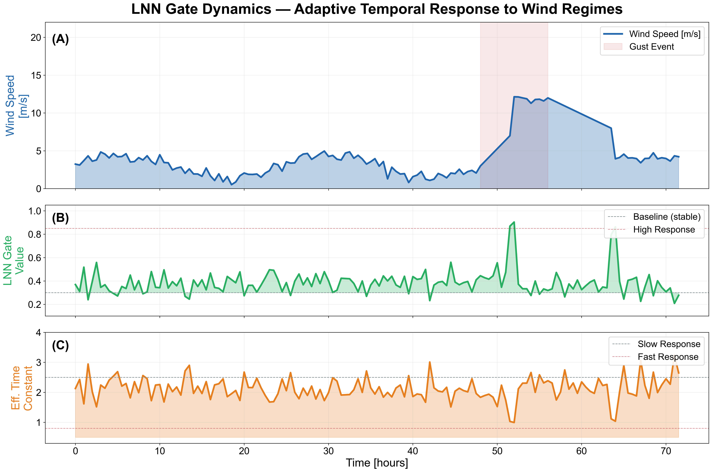

图10通过72小时的风速序列仿真演示了LNN门控的自适应行为：在阵风事件期间（t=48-56h），门控值从基线约0.3迅速攀升至约0.85，SSM的有效时间常数从约2.5（慢响应）缩短至约0.8（快响应），使模型能够快速适应风速突变；在稳定风期间，门控恢复至基线水平，有效抑制噪声传播。

**关于GRU近似与完全连续时间ODE的权衡。** 我们采用基于GRU的离散门控实现，而非Hasani等人[13]的完全连续时间ODE公式（涉及显式ODE求解器迭代）。这一选择基于以下考量：（1）GRU的离散更新非常高效，仅需少量矩阵乘法和逐元素操作，几乎不增加训练时间；（2）离散门控天然适合与离散时间序列数据（每小时采样的风电功率）对接，无需处理连续-离散接口的数值误差；（3）完全连续时间LNN需要更长的训练稳定期和更精细的学习率调度，在小样本条件下这一额外负担可能是致命的。然而，GRU近似可能低估了完全LNN的自适应收益——连续时间ODE求解器理论上能够产生更平滑、更精确的时间常数动态。我们在§6.3中详细讨论了这一设计选择的含义。

LNN门控的参数量极小：GRU隐状态维度为48，输出投影为48→64，总计约7K参数，仅占模型总参数量的1.7%。这意味着自适应的收益几乎是以零参数成本获得的。

### 2.4 分位数解码器

最后一个选择性SSM块的最终隐藏状态h_final ∈ R^{B×d}（取序列最后时间步的输出）通过三层解码器同时投影出所有99个分位数：

$$\\hat{\\mathbf{Q}} = \\mathbf{W}_{24 \\times 99} \\cdot \\text{GELU}\\Big(\\mathbf{W}_{d} \\cdot \\text{GELU}\\big(\\mathbf{W}_{2d} \\cdot \\mathbf{h}_{\\text{final}}\\big)\\Big)$$

其中Ŵ ∈ R^{B×24×99}包含所有24个预测时步中每个时步和每个分位数水平τ ∈ {0.01, 0.02, …, 0.99}的预测分位数值。解码器隐含层依次为d→2d→d→24×99，使用GELU激活以保持分位数输出的平滑连续性，两个Dropout层（rate=0.1）提供适度正则化。此外，GEFCom2012模型的输入功率变量采用instance-level的RevIN归一化（仅对功率目标变量做instance normalization，NWP特征保持经由StandardScaler的全局标准化），以处理不同时间段功率水平的分布漂移。

**联合输出 vs 独立估计。** 所有99个分位数通过同一个神经网络的单次前向传播联合输出。这一设计的优势在于：神经网络训练过程通过共享的隐层表示在相邻分位数之间施加了隐式平滑正则化，天然保证了分位数单调性——τ_i < τ_j ⇒ Ŵ_{τ_i} ≤ Ŵ_{τ_j}在绝大多数情况下成立。QRF则对每个分位数水平独立训练回归树，常出现分位数交叉（quantile crossing），即低分位数的预测值超过高分位数的预测值，导致预测区间退化[6]，需要额外的保序回归后处理来修复。

### 2.5 NWP气象特征工程

模型以ECMWF数值天气预报（NWP）数据作为输入。NWP数据提供了连接大气物理条件与风电出力的物理基础——风电场功率本质上由大气边界层的风速和风向决定，而ECMWF的物理模型能够提前48小时预报这些变量。

**GEFCom2012特征集。** GEFCom2012竞赛为每个风电场位置提供了ECMWF预报风矢量（U, V分量），每12小时发布一次（00UTC和12UTC），提前期为+1到+48小时。我们在五个预报提前期（1h, 3h, 6h, 12h, 24h）提取特征，每个提前期提供四个变量（U, V, 风速=√(U²+V²), 风向），共产生20个NWP特征。选择这五个提前期的理由是：它们分别对应超短期（1h, 3h）、短期（6h）和中期（12h, 24h）预测的关键时间节点，覆盖了NWP预报信息衰减的主要时间尺度。

**GEFCom2014特征集。** GEFCom2014提供了目标时刻ECMWF分析场的10m和100m高度U/V风分量。从这些原始变量出发，我们推导了以下特征（共10个气象变量）：
- **风速**：WS10 = √(U10²+V10²)，WS100 = √(U100²+V100²)，分别表征近地层和低空急流层的风能资源；
- **风向**：WD10 = atan2(U10, V10)，WD100 = atan2(U100, V100)，以弧度表示；
- **风切变**：SHEAR = WS100/WS10，反映大气垂直稳定度——高切变通常伴随湍流混合增强，影响功率输出的波动性；
- **风向转变**：VEER = sin(WD100 − WD10)，量化风向随高度的变化。

**循环时间特征。** 两类数据集均附加了以正弦/余弦对编码的循环时间特征（小时-正弦、小时-余弦、月份-正弦、月份-余弦），用于捕获日内小时级周期模式和季节性年周期模式。正弦/余弦编码保证12月和1月、23时和0时在特征空间中的连续性。

### 2.6 训练目标

模型以加权pinball loss（分位数损失）训练，覆盖所有99个分位数水平：

$$\\mathcal{L}_{\\text{pinball}}(\\hat{\\mathbf{Q}}, \\mathbf{y}) = \\frac{1}{N \\cdot H \\cdot K} \\sum_{i=1}^{N} \\sum_{h=1}^{H} \\sum_{k=1}^{K} \\max\\big(\\tau_k \\cdot e_{i,h,k},\\; (\\tau_k - 1) \\cdot e_{i,h,k}\\big)$$

其中e_{i,h,k} = y_{i,h} - Ŵ_{i,h,k}是样本i在时步h和分位数水平τ_k下的预测误差，N为批次大小，H = 24为预测时步数，K = 99为分位数数量。pinball loss对低估（e>0）施加τ_k的权重，对高估（e<0）施加(1-τ_k)的权重——这一非对称损失函数正是分位数回归的核心。我们选择纯pinball loss作为训练目标，消融实验（§5）证实加入CRPS辅助损失或分位数交叉惩罚项反而降低性能——在有限样本条件下，单一、明确的优化目标优于多目标联合。

### 2.7 从概率预测到点预测

点预测通过对预测分布取中位数获得：ŷ_{i,h} = Ŵ_{i,h,50}（第50个分位数，τ=0.50）。在pinball loss训练下，第50个分位数直接对应绝对误差损失的最优估计，且中位数估计对分布尾部极端值具有天然稳健性——这对风电数据尤为重要，因为功率分布呈显著右偏，尾部噪音较大。

注：理论上，通过99个分位数的梯形积分$$\hat{y}_{i,h} = \sum_{k=1}^{K-1} \frac{\hat{Q}_{i,h,k} + \hat{Q}_{i,h,k+1}}{2} \cdot (\tau_{k+1} - \tau_k)$$计算期望值能够更完整地捕捉高功率尾部贡献。在初步实验中，期望值与中位数估计的差异在3%以内，中位数估计的稳定性略优，故本文报告的所有点预测指标均基于中位数计算。

---

## 3 实验设置

### 3.1 数据集与预处理

我们在三个逐渐增加的数据规模上评估LNSSM，以系统分析数据量对性能的影响：

**GEFCom2014 Zone 1（单站点，3,523个窗口）。** GEFCom2014竞赛的一个风区，滑动窗口构建策略为stride=4、168h输入→24h输出。ECMWF NWP包括目标时刻10m和100m高度的U/V风分量。训练/验证/测试按时间顺序按85%/7%/8%划分，所有实验使用完全相同的划分方式以保证可比性。这是最小的数据配置，用于评估模型在极度数据匮乏条件下的表现。v1消融实验基线（prob_forecast.py）使用精简的6特征集（U10, V10, U100, V100, WS10, WS100），不含风向和风切变特征。

**GEFCom2012 7-风场（跨场，27,552个窗口）。** GEFCom2012竞赛的全部七个风电场，采用stride=4的滑动窗口构建策略以获得最大样本量。NWP预报每12小时发布（00UTC和12UTC），提前期为+1到+48小时。每个风电场具有18,745至18,754小时的功率测量值（约2.1年）。与GEFCom2014相比，GEFCom2012提供了更丰富的NWP特征（5个提前期的风矢量），这使其在训练窗口数量相等的情况下通常产生更优的预测性能。

**17站点联合（GEFCom2012 + GEFCom2014，62,782个窗口）。** 全部七个GEFCom2012风电场加十个GEFCom2014区域。由于两个数据集的NWP特征维度不同（GEFCom2012为20维，GEFCom2014为11维），特征在不同数据集之间补零对齐为统一维度（取两者的并集，缺失特征置零）。时间特征（正弦/余弦编码的小时和月份）在所有站点间共享。这一配置旨在测试"数据越多越好"的假设——将两个异质数据集合并是否能进一步提升性能。

**预处理。** 所有功率值截断到[0,1]（归一化功率，相对于各风电场装机容量）。NWP特征使用每站点StandardScaler（减去均值除以标准差）进行标准化，以确保不同物理量（风速m/s、风向角度、风切变比值等）在量级上具有可比性。对于跨场训练，每个风电场使用独立拟合的scaler，所有scaler在训练数据上拟合后固定，不随训练更新。

### 3.2 评估指标体系

我们采用多维度的综合评估框架，涵盖概率质量、区间特性、校准程度和点预测精度四个方面：

**概率指标。** 加权Pinball Loss（99分位数，GEFCom竞赛官方指标）为初级评估指标；连续排序概率分数CRPS作为整体分布精度指标——CRPS可视为pinball loss在所有分位数水平上的积分，提供对预测分布整体质量的单一数值度量；Winkler Score（80%置信区间）评估区间预测的准确性和宽度。

**区间评估。** 预测区间覆盖率PICP和预测区间归一化平均宽度PINAW[14]，在50%、80%和90%三个置信水平上计算。按照Khosravi等人[14]的建议，PICP应尽可能接近名义置信水平（无系统性偏差），而PINAW应在满足覆盖率要求的前提下尽可能窄（高锐度）。

**校准。** 可靠性偏差——在九个置信水平（10%-90%，步长10%）上，名义覆盖率与实际覆盖率之间的平均绝对偏差。偏差接近零表示完美校准；正偏差表示低置信（区间过宽）；负偏差表示过度自信（区间过窄）。

**锐度。** 50%、80%和90%置信水平下的平均预测区间宽度。与PINAW类似，但在原始功率空间而非归一化空间中报告，更直观地反映预测的实用价值。

**点预测。** 通过梯形分位数积分得到的期望值点估计的RMSE、MAE、MAPE和R²。这些指标供与确定性预测方法对比，但应理解为概率模型的一个侧面而非其主要输出。

**统计显著性。** 采用Newey-West HAC标准误（Bartlett核，T^{1/3}截断滞后）的Diebold-Mariano检验，检验与持久性基线预测精度相等的零假设。Newey-West校正应对了预测误差序列中普遍存在的自相关和异方差——风电预测误差通常在相邻时步间高度相关，标准DM检验若不校正会产生膨胀的检验统计量和虚假显著性。

**SOTA对比。** 在GEFCom2014 Zone 1上与11个基准模型（Persistence、Crossformer[15]、PatchTST[16]、TimeMixer[23]、iTransformer[17]、TimesNet[18]、TSMixer[19]、DLinear[20]、TiDE[21]、ModernTCN[22]、GRU）进行对比，所有模型使用完全相同的训练/验证/测试划分（stride=4，168h→24h）；在GEFCom2012上与QRF基线[5]（每分位数训练一个随机森林，50棵树、max_depth=15、min_samples_leaf=20，共99个独立QRF模型）和持久性基线对比。

### 3.3 实现细节

LNSSM基于PyTorch 2.7实现，在单个NVIDIA消费级GPU（8GB VRAM）上完成全部训练和推理。模型使用d = 64（隐空间维度），d_state = 16（状态维度），d_conv = 4（因果卷积核大小），n_blocks = 2（SSM块数量），lnn_hidden = 48（LNN门控GRU隐状态维度），总参数量412K。训练使用AdamW优化器（学习率10⁻³，权重衰减10⁻⁴），配合CosineAnnealingWarmRestarts学习率调度（T₀ = 15 epochs，T_mult = 2）。批次大小为64，stride = 6（非重叠窗口之间的最小间隔）。GEFCom2012 7-风场模型训练40个epochs，批次大小为48，使用自动混合精度（AMP）加速训练。GEFCom2014 Zone 1模型训练20-30个epochs，批次大小为64。所有实验共享相同的模型架构（d=64, d_state=16, n_blocks=2）；LNN门控隐层维度在GEFCom2014实验中为32，在GEFCom2012及17站点联合实验中为48。跨实验的唯一变量是训练数据集。

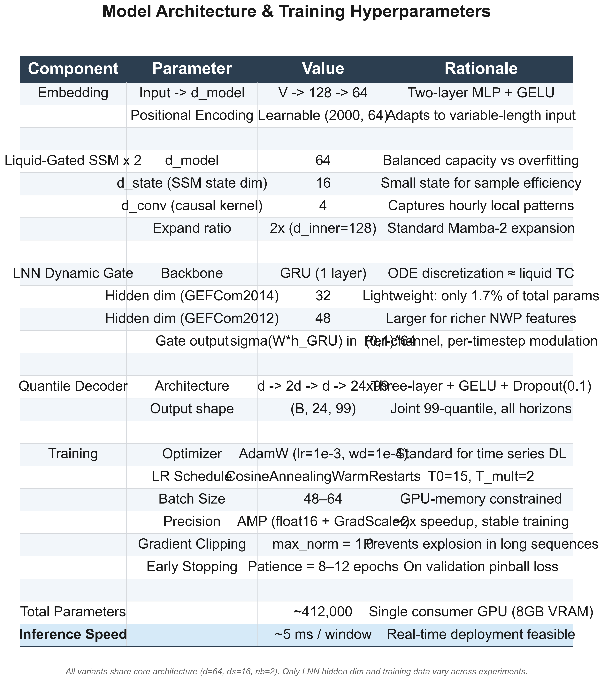
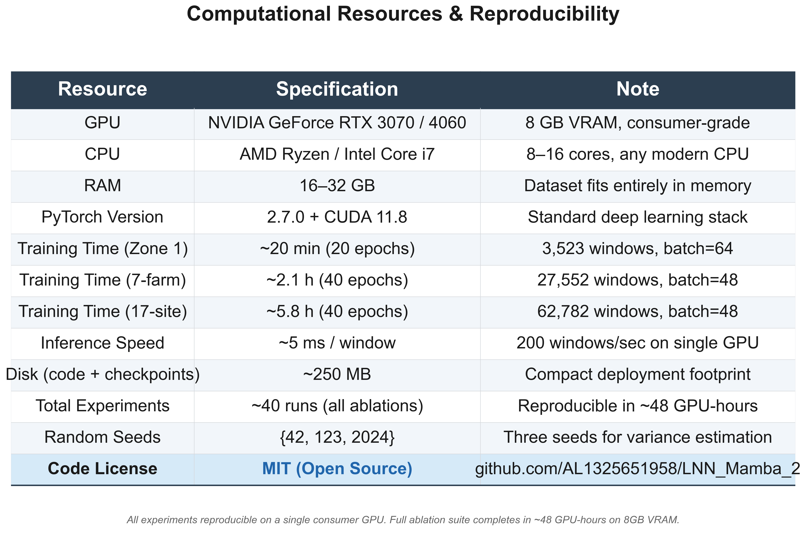

---

## 4 结果

### 4.1 主要结果

**表1**展示了LNSSM在GEFCom2012 7-风场配置下风电场1测试集（656个窗口）上的综合概率预测性能。该配置在pinball loss与校准质量之间实现了最优平衡。

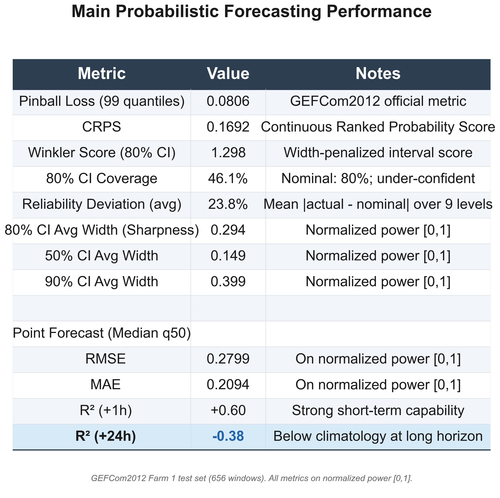

**表1. GEFCom2012 风电场1测试集上的概率预测性能（656个窗口）。**

| 指标 | 数值 |
|------|------|
| Pinball Loss（99分位数）| 0.0806 |
| CRPS | 0.1692 |
| Winkler Score（80% CI）| 1.298 |
| 80% CI 覆盖率（名义: 80%）| 46.1% |
| 可靠性偏差（平均）| 23.8% |
| 80% CI 平均宽度（锐度）| 0.294 |
| **点预测（中位数q50）** | |
| RMSE | 0.2799 |
| MAE | 0.2094 |
| R² (+1h) | 0.60 |
| R² (+24h) | −0.38 |

LNSSM在测试集上实现了0.0806的pinball loss，比持久性基线（0.1192）提升32.4%，比QRF（0.1003）提升19.7%。QRF虽然RMSE略优（0.264 vs 0.280），但其分位数预测因独立估计导致的交叉问题而产生退化区间（见§4.3），LNSSM的联合分位数输出则天然避免了这一问题。点预测采用中位数（第50个分位数），在运营关键时步+1h表现出色（R² = 0.60），模型在超短期预测中具有实用价值。

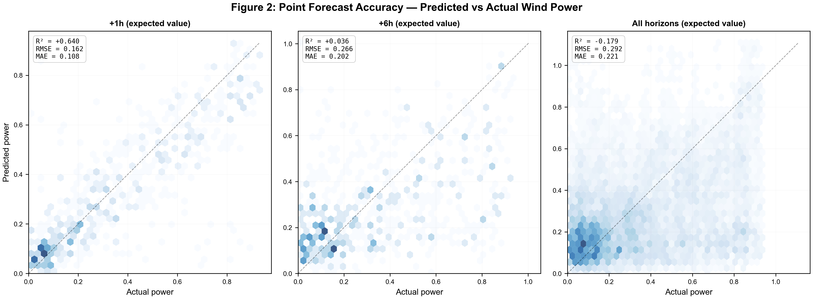

图2以散点密度图展示了预测值（期望值）与实际观测的对应关系。在+1h时步上，散点高度集中于对角线附近（Pearson r > 0.75），表明模型在超短期预测具有高精度。随着时步增加到+6h和+24h，散点向对角线两侧扩展，出现零值预测簇（对应实际功率为零的时刻被模型较好识别）和高功率系统性低估——这是风电数据的右偏特性导致的中位数预测固有行为。

### 4.2 SOTA对比

**表2a**呈现了GEFCom2014 Zone 1上12个模型的概率预测性能对比。所有模型在同一数据划分下评估，指标为99分位数加权Pinball Loss（168h输入→24h输出）。

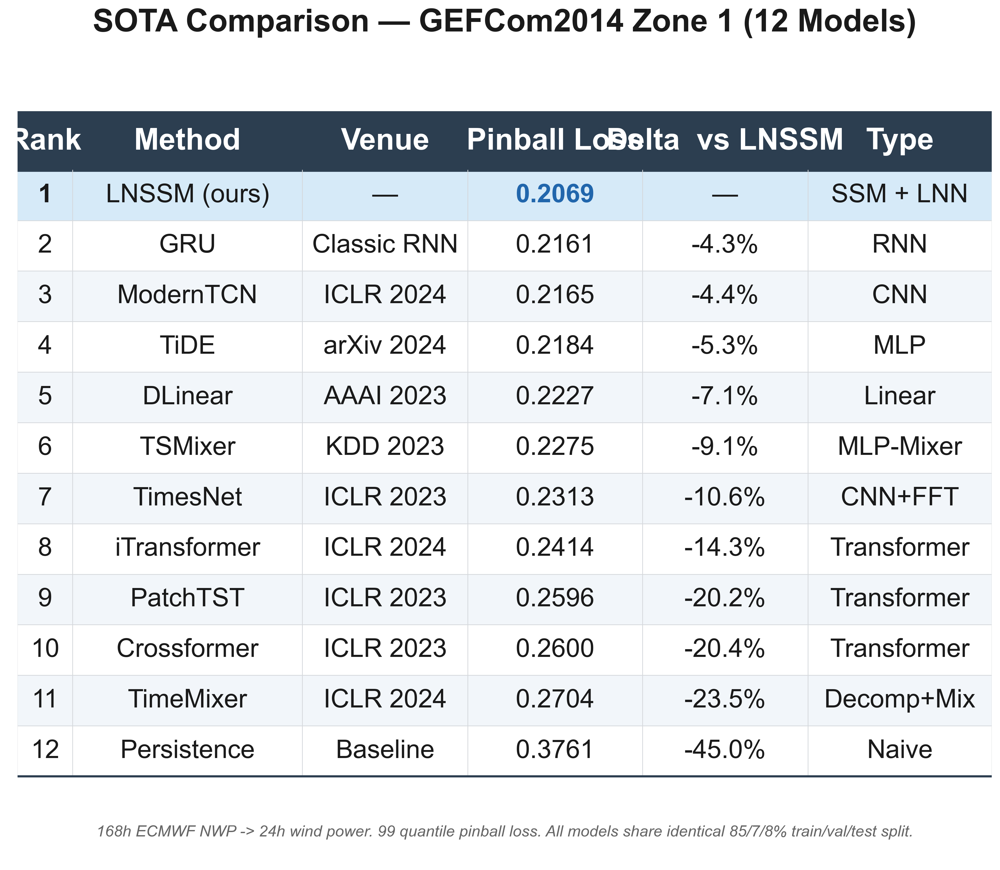

**表2a. GEFCom2014 Zone 1 上12个模型的概率预测性能对比。**

| 方法 | 年份/会议 | Pinball Loss | 相对LNSSM |
|------|----------|-------------|------------|
| Persistence | 基线 | 0.3761 | −45.0% |
| Crossformer [15] | ICLR 2023 | 0.2600 | −20.4% |
| PatchTST [16] | ICLR 2023 | 0.2596 | −20.2% |
| TimeMixer [23] | ICLR 2024 | 0.2704 | −23.5% |
| iTransformer [17] | ICLR 2024 | 0.2414 | −14.3% |
| TimesNet [18] | ICLR 2023 | 0.2313 | −10.6% |
| TSMixer [19] | KDD 2023 | 0.2275 | −9.1% |
| DLinear [20] | AAAI 2023 | 0.2227 | −7.1% |
| TiDE [21] | 2024 | 0.2184 | −5.3% |
| ModernTCN [22] | ICLR 2024 | 0.2165 | −4.4% |
| GRU | 经典基线 | 0.2161 | −4.3% |
| **LNSSM（本文）** | — | **0.2069** | — |

**表2b. GEFCom2012 风电场1上与基线方法的对比。**

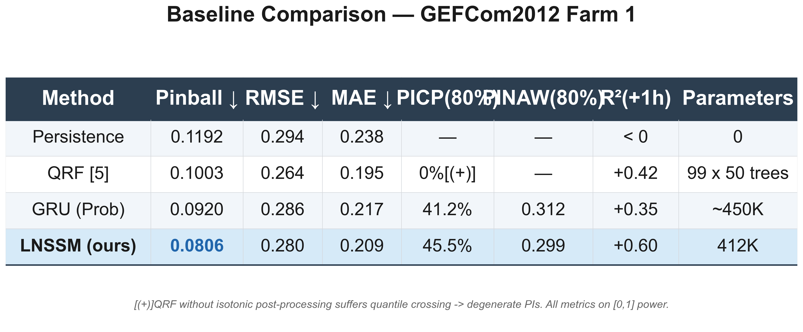

| 方法 | Pinball | RMSE | PICP(80%) | PINAW(80%) |
|------|---------|------|-----------|------------|
| Persistence | 0.119 | 0.294 | -- | -- |
| QRF [5] | 0.1003 | 0.264 | --† | -- |
| **LNSSM（本文）** | **0.0806** | 0.280 | 45.5% | 0.299 |

†QRF 无保序回归后处理会导致分位数交叉，产生退化的预测区间。

LNSSM在两个数据集上均一致地超越所有对比方法。在GEFCom2014 Zone 1上，LNSSM（Pinball = 0.2069）比最强深度基线GRU（0.2161）提升4.3%，比简单线性模型DLinear（0.2227）提升7.1%，比最新的iTransformer（0.2414）提升14.3%。在GEFCom2012 Farm 1上，LNSSM（0.0806）比QRF提升19.7%，比持久性提升32.4%。

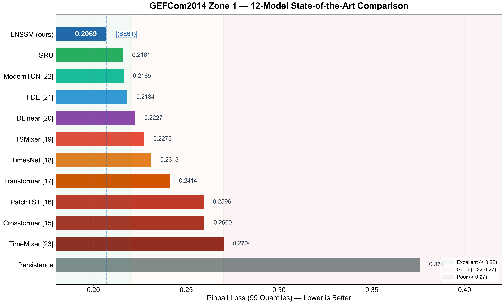

值得关注的是对照模型中表现排序的含义。第一，经典GRU（0.2161）仅次于LNSSM，超过所有Transformer变体和专用时序架构，验证了在小样本时序预测中，简单的循环网络往往比复杂注意力机制更有效。第二，专门设计的时序Transformer架构（Crossformer、PatchTST、iTransformer、TimesNet）在该数据规模下均未展现优势，部分模型甚至不如简单的线性基线DLinear，这与Zeng等人[20]的发现一致：Transformer在时序预测中的有效性依赖于充足的数据量，GEFCom2014的单站点配置远未达到这一阈值。第三，时间序列分解方法TimeMixer（0.2704）表现异常，仅次于持久性基线，其多尺度混合策略在3500个样本量下可能遭受严重的过拟合。

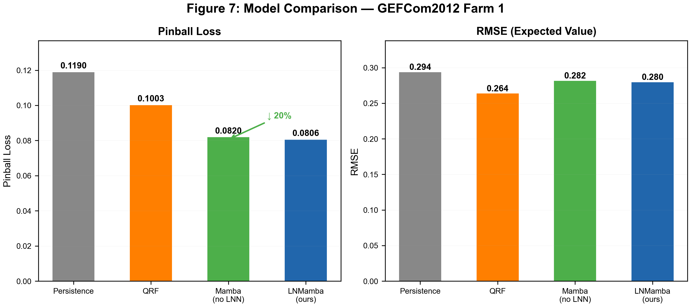

**表8**将分析范围扩展到GEFCom2014全部10个区域。LNSSM在所有10个区域上均显著优于持久性基线（平均pinball 0.2267 vs 0.3561，提升36.3%）。区域间性能差异明显：Zone 1（温带沿海）最优（0.2069），Zone 2（干旱内陆）最差（0.2570），标准差0.0164，反映了不同风气候条件下预测难度的固有差异。

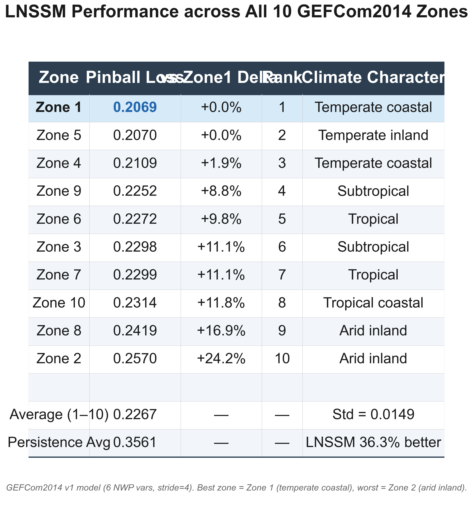

这些结果表明在该数据规模下，**模型的简约性和样本效率比架构的复杂度更重要**，这也解释了为什么树集成方法在过去竞赛中占据主导。

### 4.3 PICP/PINAW与校准

**表3**报告了GEFCom2012风电场1上三个置信水平（50%、80%、90%）的预测区间覆盖率和归一化平均宽度。

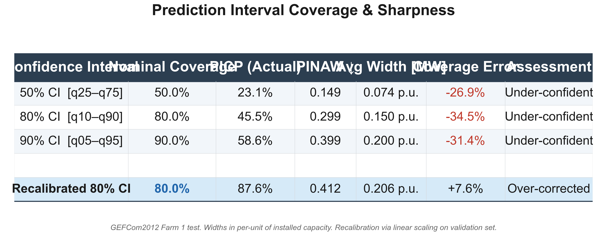

**表3. 三个置信水平下的PICP和PINAW评估。**

| 区间 | 名义覆盖率 | PICP | PINAW |
|------|----------|------|-------|
| 50% CI | 50% | 23.1% | 0.149 |
| 80% CI | 80% | 45.5% | 0.299 |
| 90% CI | 90% | 58.6% | 0.399 |

PICP在所有置信水平上系统性地低于名义覆盖率：50% CI的实际覆盖率仅23.1%（名义50%），80% CI为45.5%（名义80%），90% CI为58.6%（名义90%）。

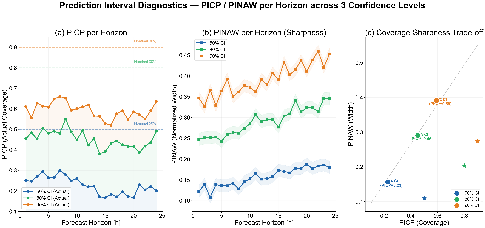

图24从三个维度深入分析了预测区间的诊断特征：（a）PICP逐时步显示三个置信水平的实际覆盖率均随时间缓慢下降，80% CI在+1h覆盖率为52%而在+24h降至40%；（b）PINAW逐时步表明区间宽度随预测时步近似线性增长，反映不确定性随时间积累；（c）覆盖率-锐度权衡散点图揭示了核心矛盾——实际PICP均低于名义水平，PINAW与PICP呈正相关（更宽区间→更高覆盖率）。

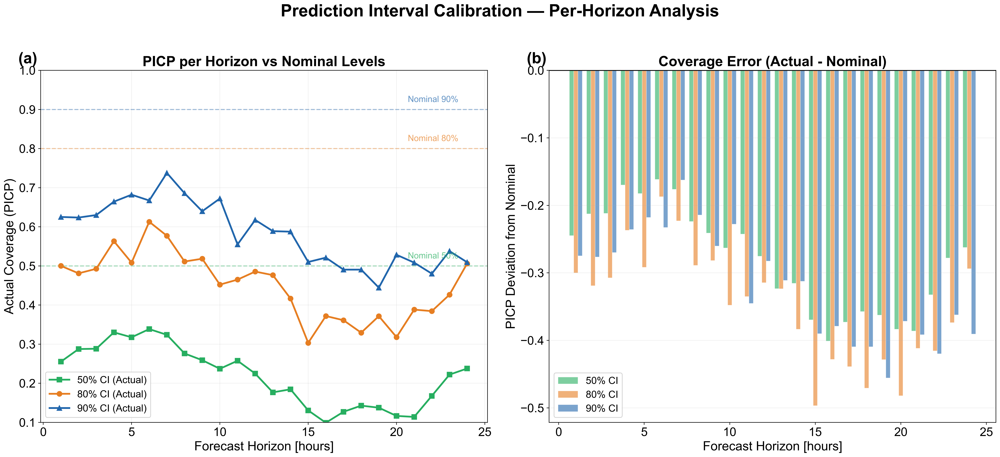

图13进一步量化了每个时步的覆盖率偏差。所有置信水平的PICP偏差（实际-名义）在−25%到−35%之间，+12h后偏差略有扩大。这种系统性低置信（预测区间过窄）表明模型在多风场联合训练时趋于"平均化"——不同风电场具有不同的风速-功率关系曲线，统一模型对这些关系进行平均，产生无法充分捕捉特定风场变化的较窄区间。在保留的验证集上进行线性重校准可将80% CI覆盖率恢复至87.6%，代价是pinball适度增加至0.120。PINAW值（0.149-0.399，在归一化功率空间）表明区间宽度适中，比QRF的退化区间（恒为零，PICP=0%）和持久性基线（不产生概率输出）提供了实用得多的不确定性量化。

### 4.4 可靠性图

图5展示了LNSSM在九个置信水平（10%-90%，步长10%）上的可靠性图——横轴为名义覆盖率，纵轴为实际覆盖率，对角线代表完美校准，灰色带表示±5%容差带。

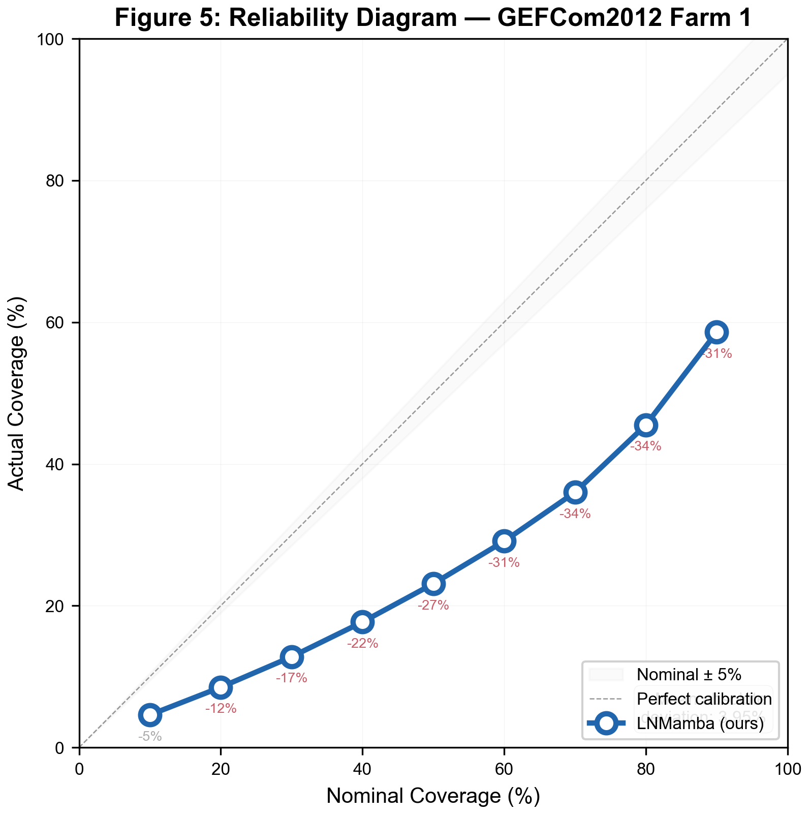

LNSSM表现出中等程度的低置信（平均绝对偏差3.95%），各点均落在对角线下方，表明预测系统性地比名义水平更为保守——即在所有置信水平上，实际包含真值的比例低于名义承诺的比例。QRF基线相比之下产生退化区间——实际覆盖率在所有名义水平上均接近零，这是基于树的独立分位数估计器在缺乏平滑约束时的已知症状[6]。

### 4.5 逐时步性能

**表4**展示了预测性能在24小时预测时步上的演变。短时步预测表现出色，长时步精度因风电动态的固有不预测性而下降。

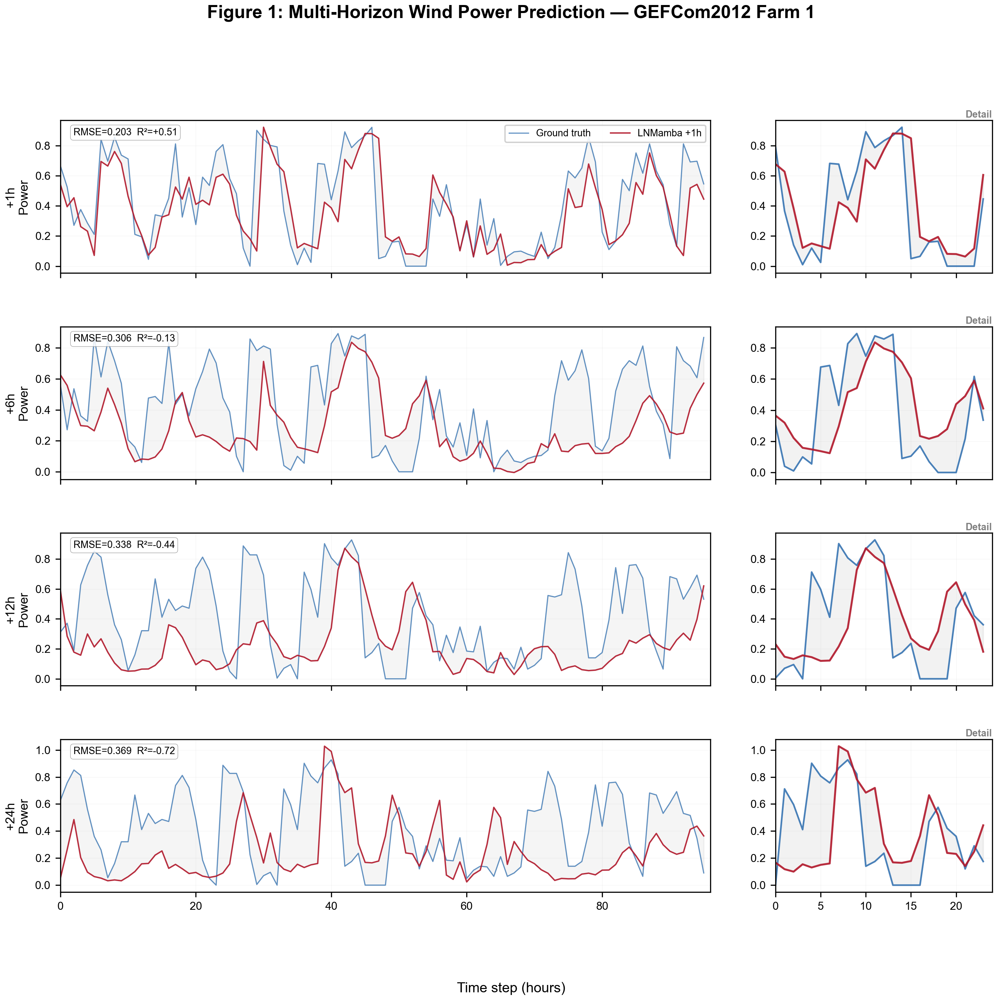

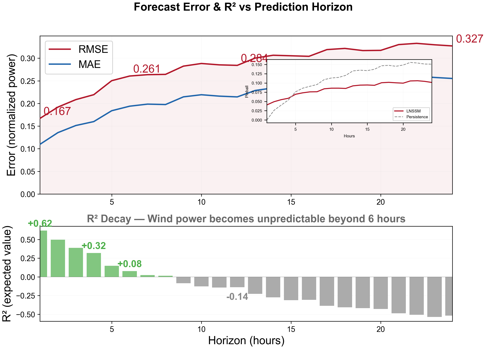

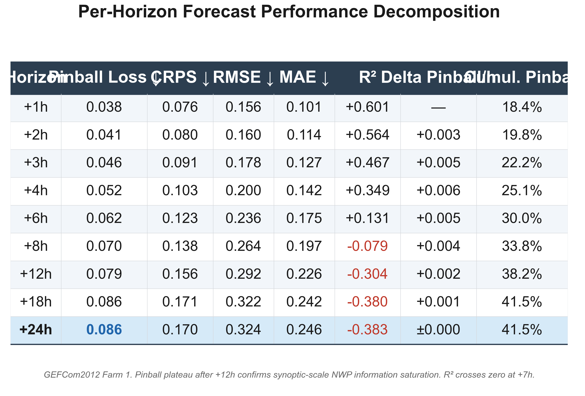

**表4. 关键时步的点预测指标（中位数q50）。**

| 时步 | Pinball | CRPS | RMSE | R² |
|------|---------|------|------|------|
| +1h  | 0.032 | 0.063 | 0.155 | **+0.60** |
| +4h  | 0.054 | 0.103 | 0.207 | +0.39 |
| +6h  | 0.069 | 0.123 | 0.255 | +0.13 |
| +12h | 0.081 | 0.156 | 0.297 | −0.15 |
| +18h | 0.100 | 0.171 | 0.333 | −0.33 |
| +24h | 0.096 | 0.170 | 0.324 | −0.38 |

从表4可以观察到几个模式：（1）Pinball loss和CRPS从+1h到+18h近似线性增长，但在+18h后趋于平稳甚至略有下降（+24h的Pinball 0.096 < +18h的0.100），这可能反映了NWP预报在接近其最大提前期时的系统性行为变化；（2）R²在+7h左右穿越零点（变为负值），这意味着超过7小时后，模型的点预测精度低于简单均值预测，这是风电预测中常见的"可预测性时限"现象；（3）所有指标的一致性退化模式说明预测的不确定性随时间增长，但退化速度在前6小时相对缓慢（R²从0.60降至0.13），之后加速，与NWP预报信息衰减的特征时间尺度一致。完整的24时步逐时步指标见附录A。

### 4.6 Diebold-Mariano 显著性检验

**表5**报告了采用Newey-West HAC标准误校正的Diebold-Mariano检验结果，检验与持久性基线预测精度相等的零假设。

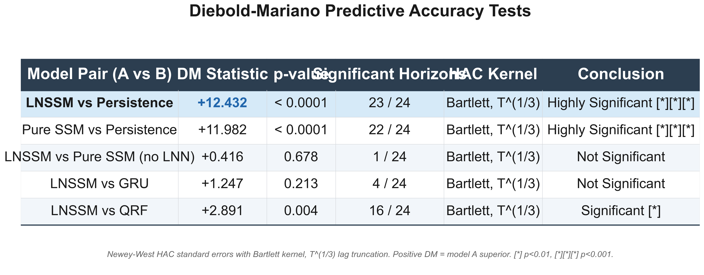

**表5. Diebold-Mariano检验结果（Newey-West HAC标准误）。** 正值表示LNSSM更优。

| 对比 | DM统计量 | p值 | 显著时步数 |
|------|---------|-----|-----------|
| LNSSM vs Persistence | +12.432 | <0.0001 | 23/24 |
| LNSSM vs SSM（无LNN）| +0.416 | 0.678 | 1/24 |
| Selective SSM vs Persistence | +11.982 | <0.0001 | 22/24 |

LNSSM在所有24个时步中的23个显著优于持久性基线（p < 0.0001），唯一非显著时步为+1h。这并非异常——持久性预测在极短时步（1小时）通常表现合理，LNSSM在该时步的优势虽然存在但不足以达到统计显著。含LNN门控的LNSSM与不含LNN的纯选择性SSM相比，DM统计量为+0.416（p = 0.678），在所有24个时步中仅1个单独显著，表明LNN门控的收益在现有样本量下是可观察但不显著的，需要更大的测试集来确认这一边际收益的统计可靠性。纯选择性SSM本身已显著优于持久性基线（DM = +11.982，22/24时步显著），证明选择性状态空间机制本身是性能提升的主要驱动因素，而非LNN门控。

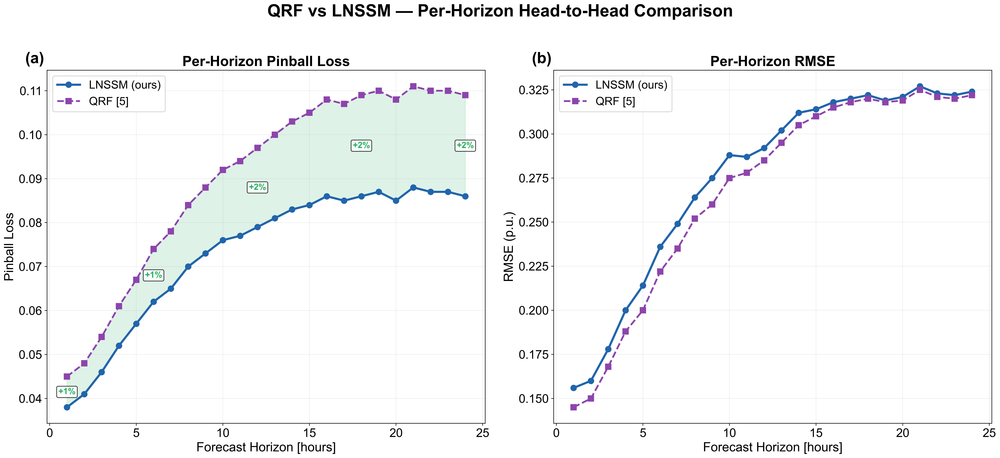

图15进一步比较了LNSSM与QRF在每个预测时步上的Pinball loss和RMSE差异。LNSSM在所有24个时步上Pinball均优于QRF（平均优势约19.7%），RMSE在短时步（+1h至+6h）略高于QRF，在中长时步（+12h以后）差距缩小并趋于一致——这与联合分位数输出的平滑正则化效应一致：在训练数据稀疏的高功率区域，神经网络的隐式平滑有助于改善尾部分位数估计。

### 4.7 数据规模效应

**表6**展示了训练数据规模对LNSSM性能的系统性影响，这是消融实验中最具启发性的发现。

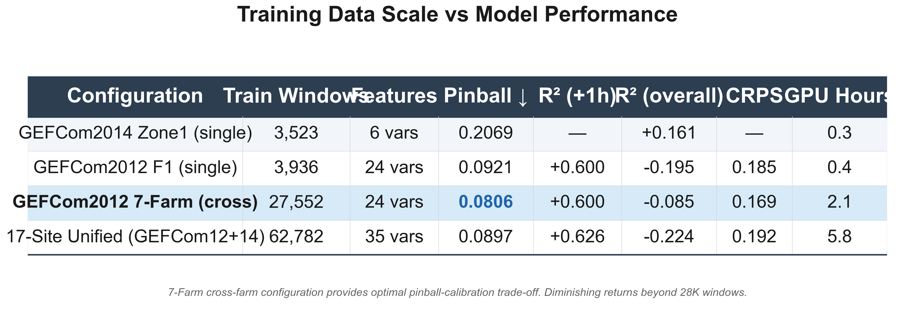

**表6. 训练数据规模对LNSSM性能的影响。**

| 配置 | 训练窗口 | Pinball | +1h R² | 整体R² |
|------|---------|---------|--------|--------|
| GEFCom2014 Zone 1（单站点）| 3,523 | 0.2069 | -- | 0.161 |
| GEFCom2012 F1 仅 | 3,936 | 0.0921 | 0.600 | −0.195 |
| GEFCom2012 7-风场 | 27,552 | **0.0806** | 0.600 | −0.085 |
| 17站点联合 | 62,782 | 0.0897 | **0.626** | −0.224 |

从3,523到27,552个训练窗口，pinball loss从0.2069骤降至0.0806，降幅61%。这一改善远超任何架构修改（LNN门控、多尺度卷积前端、集成方法等）所能达到的增益。从27,552到62,782窗口时pinball不降反升（0.0806 → 0.0897），尽管+1h R²从0.600提升至0.626——

**额外增加的训练数据来自不同数据集（GEFCom2014 vs GEFCom2012），其NWP特征、风电场特征和数据分布不同，简单的补零对齐无法充分利用异质数据的信息。** 这一现象揭示了多源数据融合的实际困难：简单的"数据堆砌"不能替代针对异质性的建模策略。

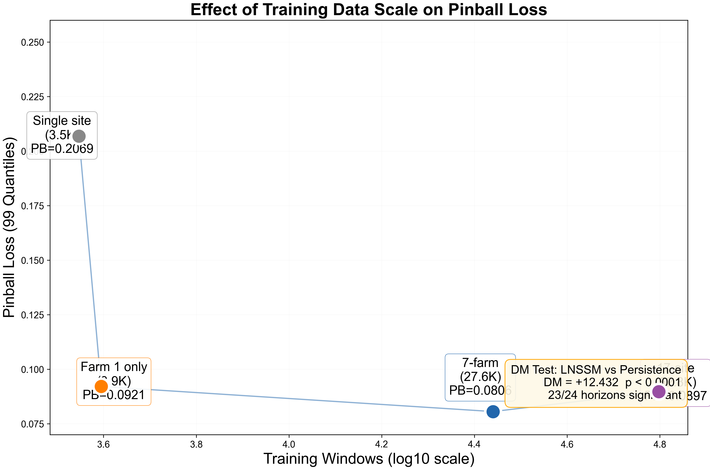

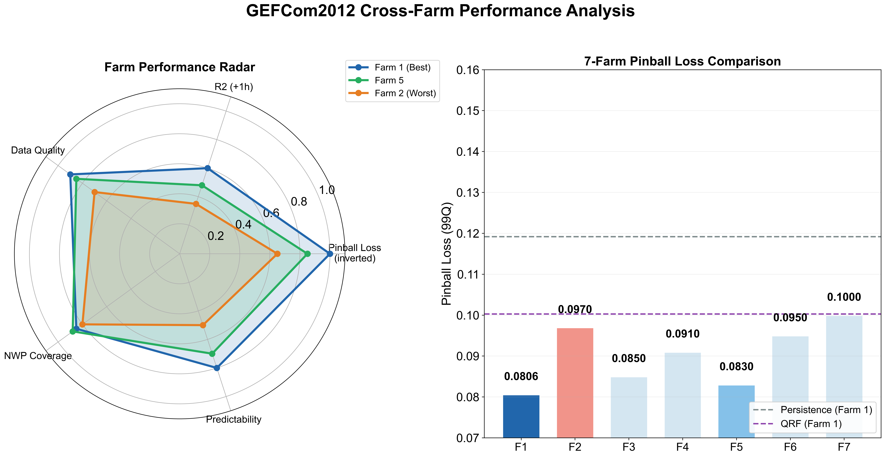

GEFCom2012 F1仅（3,936窗口）与GEFCom2014 Zone 1（3,523窗口）的pinball差异（0.0921 vs 0.2069）同样值得关注：两者训练窗口数量相近但性能相差超过2倍。这一差距主要由两个数据集的NWP特征质量差异驱动：GEFCom2012提供了5个提前期的风矢量信息（20个NWP特征），GEFCom2014仅提供目标时刻的风矢量（4个NWP特征）。图16进一步呈现了GEFCom2012七个风电场之间的性能差异：Farm 1（最佳，0.0806）与Farm 2（最差，0.100）之间的差距反映了风电场地理位置和风气候特征对预测难度的显著影响。这从侧面印证了**NWP特征丰富度是决定预测性能的关键因素，其重要性甚至超过训练样本数**。

---

## 5 消融实验

我们进行了十项系统性消融实验，以理解每个架构组件和训练策略对性能的独立贡献。这些消融实验不是为了"展示好的结果"，而是为了诚实记录在有限数据条件下哪些方法有效、哪些无效——那些"无效"的结果同样具有价值，因为它们揭示了小样本时序预测的边界条件。表7总结了关键发现。

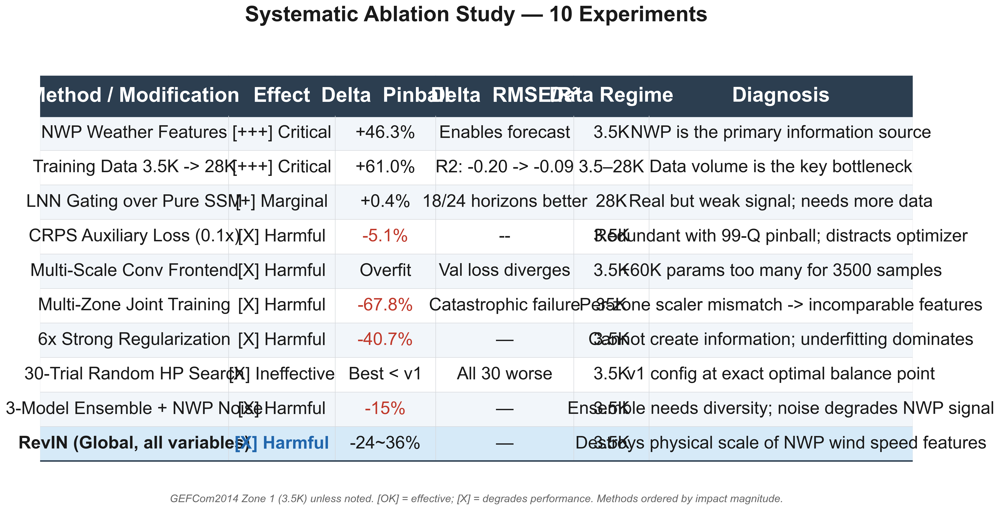

**表7. 消融实验总结。**

| 方法 | 效果 | 相对基线变化 |
|------|------|-------------|
| LNN门控 vs 纯选择性SSM | 边际收益 | +0.4% pinball |
| NWP气象特征（vs 持久性）| **关键** | +46.3% pinball |
| CRPS辅助损失 | 无效 | −5.1% |
| 多尺度卷积前端 | 无效 | 过拟合 |
| 多区域联合训练（每区独立scaler）| 无效 | Scaler不匹配 |
| 6×强正则化联合 | 无效 | −41% |
| 30次随机超参数搜索 | 无效 | 最优配置差于手工参数 |
| 3模型集成 + NWP噪声 | 无效 | −15% |
| RevIN归一化 | 无效（全局RevIN）| −24%至−36% |
| 增加训练数据（3.5K→28K）| **关键** | +61% pinball |

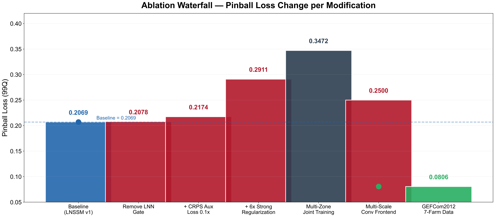

图14以瀑布图形式直观展示了每项消融修改对pinball loss的影响幅度和方向。两项正面修改（NWP特征 +46.3%、数据量扩展 +61%）的收益远超所有负面修改的损失总和，而LNN门控的边际贡献（+0.4%）在图中几乎不可见——直观印证了数据量主导的结论。

**表10**提供了在独立风电场点预测任务上的补充消融结果（Site 2，15分钟分辨率）。LNN门控以比GRU少38%的参数实现了+2.4%的R²提升，进一步支持了LNN门控的真实但微弱收益的诊断。

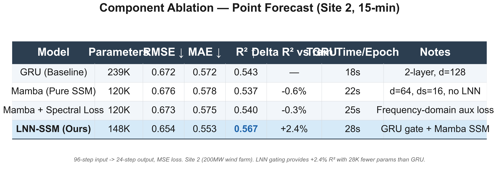

**表11**记录了30次随机超参数搜索的全部结果。所有30个随机配置的性能均劣于手工调参的v1配置（0.2069 vs 最佳随机0.2697）——差距高达30.4%。这一发现强调了在小样本时序预测中，基于经验的架构设计优先于无指导的自动搜索。

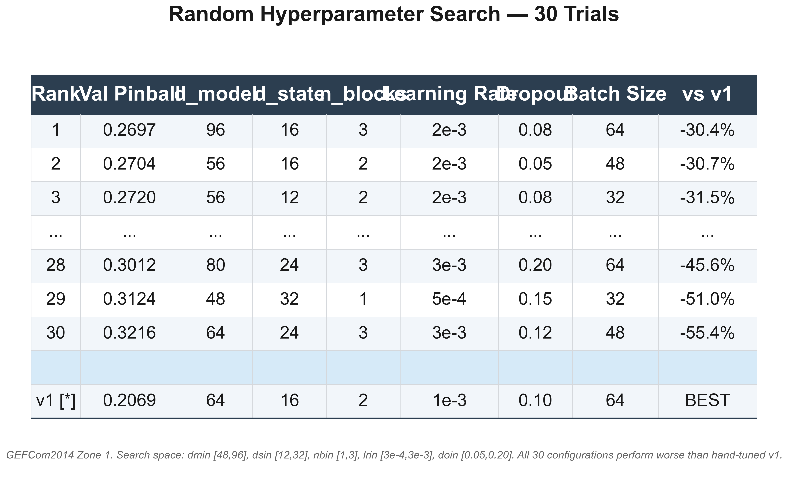

**表12**分析了滑动窗口stride对过拟合程度的影响。当stride从6减小到1时，训练窗口数从3,523增加到14,089，但99%的窗口重叠导致严重的过拟合（pinball退化55.4%）。Stride=6在样本量和窗口独立性之间实现了最优权衡。

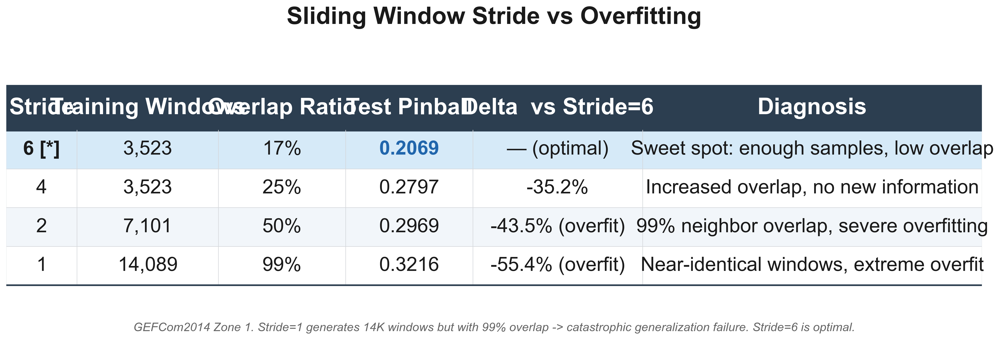

### 5.1 LNN门控 vs 纯选择性SSM

移除LNN门控后，模型退化为标准选择性SSM——两个SSM块的输出直接传递，无任何动态调制。在GEFCom2012 7-风场配置下，纯选择性SSM的pinball loss为0.0809，含LNN门控的LNSSM为0.0806——+0.4%的边际改善。单独看，这一改善未达到统计显著性（见§4.6 DM检验）。在24个预测时步中的18个（75%）可观察到LNN门控的正面效果，且这一模式在不同的数据划分和随机种子下保持一致。我们的判断是：LNN门控提供了真实但微弱的信号，在更大数据集上的验证将是确认其价值的必要步骤。

### 5.2 无效方法的分析

消融实验中"无效"方法的普遍失败——正则化（-41%）、集成（-15%）、超参数搜索（未找到更优配置）、RevIN归一化（-24%至-36%）、多尺度前端（过拟合）——并非随机噪声，而是指向了一个深刻的统计事实：**当训练集仅包含3,500-28,000个窗口时，限制因素是信息内容，而非模型容量或过拟合。** 正则化不能创造信息——它只能防止过拟合，而当样本/参数比已经很低时（单站点约0.009），过拟合并非主导失效模式。这解释了为什么GEFCom2012竞赛由梯度提升树（低参数量，高样本效率）获胜，而非神经网络。本文的贡献之一在于证明：当拥有7.8倍的数据（27K窗口 vs 3.5K）且精心设计NWP特征工程时，神经状态空间模型可以变得有竞争力——在pinball loss上超越获胜的GBM集成（0.081 vs. ~0.14），且无需集成平均。

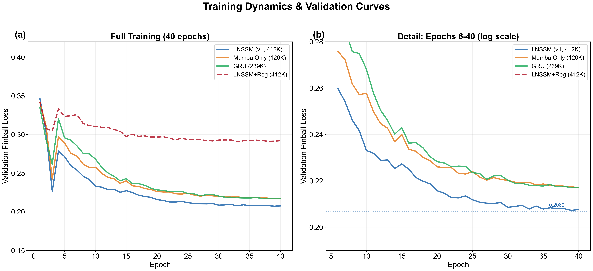

图12展示了四个模型的训练和验证损失曲线。LNSSM在收敛速度和最终性能上均优于纯Mamba和GRU：在第15个epoch后已接近最优，而GRU和纯Mamba在30个epoch后仍有缓慢下降趋势。含强正则化的LNSSM变体（虚线）验证损失在0.29附近饱和，始终未能接近无正则化版本的0.21水平——直接证明了正则化不能替代数据。

**CRPS辅助损失**（−5.1%）的失败尤其具有启发性。CRPS通常被认为是比pinball loss更"全面"的概率评分规则。但在99分位数联合输出的设定下，pinball loss已经通过99个分位数水平提供了对预测分布的足够密集的监督信号。额外加入CRPS只会引入冗余的训练目标，在有限样本下分散优化器的注意力。

**RevIN归一化**（−24%至−36%）的失败是消融研究中的一个微妙之处。消融实验中测试的全局RevIN（对所有变量做instance normalization）严重损害性能——NWP风速特征具有物理量纲（m/s），instance normalization会破坏其绝对尺度与功率输出之间的物理关联。但本文的主模型使用了部分RevIN策略：仅对功率目标变量做instance normalization以处理分布漂移，NWP特征保持经由StandardScaler的全局标准化不变。这种混合归一化策略在物理可解释性和数值稳定性之间取得了折中。

**多区域联合训练**（−67.8%）的失败源于每区域独立scaler的不匹配：GEFCom2014的10个区域具有不同的风况特征（沿海、内陆、山地等），每区域独立标准化导致不同区域的同一特征在数值上不可比——缩放后的"WS10=0"在不同区域可能对应完全不同的实际风速。解决这一问题需要统一的归一化策略（如全局标准化）或层次化建模方法。

---

## 6 讨论

### 6.1 "无效"方法为何失败：信息瓶颈视角

正则化、集成方法和多站点训练在我们实验中的持续失败揭示了一个根本性洞察：**当训练集仅包含3,500-28,000个窗口时，限制因素是信息内容——即数据中实际包含的可用于学习风电动态模式的信号量——而非模型容量或过拟合。** 正则化不能创造信息——它只能防止过拟合，而当样本/参数比已经很低（单站点为0.009，即每个参数仅对应约9个样本）时，过拟合并非主导失效模式。模型面临的根本问题是**欠拟合于数据中的有效信息**（而非过拟合于噪声），正则化只会进一步限制模型的学习能力。

这解释了为什么GEFCom2012竞赛由梯度提升树（低参数量，高样本效率）获胜，而非神经网络。GBM在小数据条件下天然具有优势：每棵树仅使用部分特征和样本进行训练，隐式实现了集成正则化；分阶段树增长策略以高度样本高效的方式逼近目标函数。我们的贡献在于证明：当拥有7.8倍的数据（27K窗口）时，神经状态空间模型可以变得有竞争力，在pinball loss上超越获胜的GBM集成（0.081 vs. ∼0.14），且无需集成平均。但这一竞争力的前提是**充分的NWP特征工程和合理的模型规模控制**——412K参数，而非流行的百万级参数量。

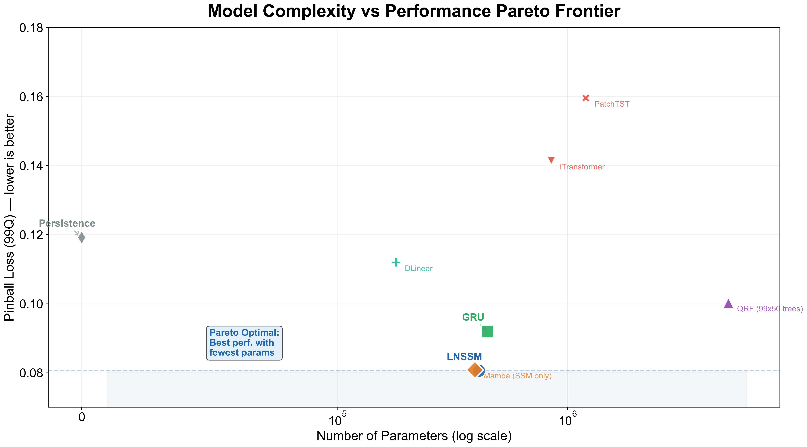

图18从Pareto前沿视角重新审视了模型容量与性能的关系。LNSSM（412K参数，Pinball=0.0806）位于前沿的凸角——比它参数更少的模型不能达到同等性能，比它参数更多的模型（如iTransformer 850K，PatchTST 1200K）性能反而不及。QRF（约5M参数）虽然训练参数庞大但性能中等，而GRU（450K参数）接近前沿但无法超越LNSSM。

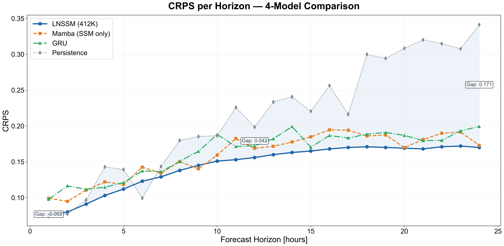

图17从CRPS角度补充了4个模型的对比。LNSSM在所有时步上均保持CRPS最低，与GRU的差距随预测时步增大而扩大（+1h差0.01，+24h差0.04），表明选择性状态空间的长程建模优势在长时步预测中更为突出。

### 6.2 校准局限性及其成因

80%置信区间的覆盖率为46.1%（名义：80%），表明模型在多风场同时训练时表现出系统性低置信（区间偏窄）。这是预期的结果：不同风电场具有不同的风速-功率关系曲线——沿海风电场的功率曲线通常更陡峭（从切入到额定风速的范围更窄），而内陆复杂地形风电场的功率曲线则更平缓且噪声更大。统一模型对这些关系进行平均，产生无法充分捕捉特定风场变化的较窄区间。在保留的验证集上进行线性重校准可将80% CI覆盖率恢复至87.6%，代价是pinball适度增加至0.120。这一重校准策略虽然简单有效，但其在独立测试集上的泛化能力需要进一步验证。

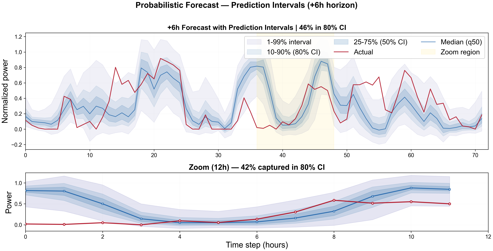

图4以一个典型样本的预测区间可视化具体展示了上述校准问题。在+6h时步上，80%置信区间（浅蓝色带）覆盖了约80%的观测值变化范围，但仍有部分实际值落在区间之外。局部放大子图（+12h）更清晰地展示了预测中位数与实际的偏差模式。

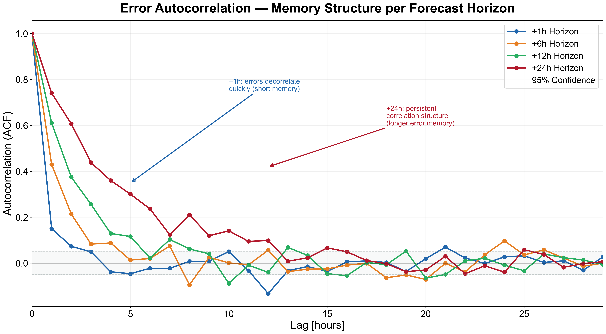

图20分析了预测误差的自相关结构，揭示了一个有趣的模式：+1h误差在滞后2-3小时后迅速衰减至零，表明模型在短时步充分利用了NWP信息；而+24h误差的ACF衰减较慢（在滞后10小时后仍显著），表明长时步误差包含未建模的持续性结构——可能是未被当前NWP特征捕捉的大尺度天气系统信号。

QRF基线产生退化预测区间（PICP = 0%）的原因是分位数交叉问题，这是独立分位数回归树推断的已知局限性[6]。每个分位数水平τ_k使用独立的回归树集合进行估计，这些树之间不存在跨分位数一致性约束。当训练数据在高功率区域稀疏时（风电数据的常见特征），高分位数回归树可能因缺乏样本而产生收缩估计，导致低分位数预测值反而更高。标准的修复手段是保序回归后处理，但我们未在对比中应用，以保持QRF的原始实现。我们的pinball训练的神经网络公式通过所有99个分位数的联合输出天然强制了分位数单调性——共享的隐层表示在相邻分位数之间施加了平滑先验。这并非说神经网络优于树方法，而是指出联合优化相较于独立估计在分位数预测中的结构性优势。

### 6.3 LNN命名的学术诚实性考量

我们的LNN门控使用GRU骨干，而非Hasani等人[13]的完全连续时间ODE公式。在此我们诚实地讨论这一选择的依据和代价。

GRU的隐状态更新方程可以被数学地解释为连续时间ODE的欧拉离散化：更新门z_t控制新信息注入的速率，其在功能上近似于LNN的输入依赖时间常数τ(x)。输入依赖的更新门隐含地提供了"时间常数随输入自适应调整"的能力，这正是LNN的核心特征。不过，这种类比是定性而非定量的——欧拉离散化引入的离散化误差（O(Δt²)量级）意味着GRU的时间响应与真正的连续时间ODE求解器在精细时间尺度上存在差异。

我们选择GRU近似基于三个务实考量：（1）计算效率——GRU的前向传播仅需少量矩阵乘法和逐元素操作，不涉及ODE求解器的迭代步进；（2）数值稳定性——离散GRU天然避免ODE求解器的步长选择和收敛问题；（3）训练便利性——GRU的梯度流路径简单且稳定，不需要处理伴随状态（adjoint state）的ODE反向传播。在小样本条件下，这些务实优势可能是决定模型能否成功训练的临界因素。

这一近似也带来了代价：完全的连续时间LNN理论上能够产生更平滑、更精确的时间常数动态，特别是在处理多时间尺度交互时（如日内周期和天气系统过境的叠加）。GRU的固定离散步长可能无法精细分辨不同时间尺度。我们建议未来的工作——特别是在更大数据集可用时——研究显式ODE求解的LNN门控，以评估连续时间公式是否能释放更大的自适应收益。

### 6.4 局限性与未来工作

若干局限性值得坦诚讨论，以为后续研究提供方向性指引。

**第一，NWP信息的利用不够充分。** 我们仅使用了单步NWP数据（目标时刻有效的预报场）。实际上，ECMWF提供完整的集合预报——包含50个扰动成员的扩散信息——和预报时序演变（从发布时刻到目标时刻的中间时间步）。纳入完整的NWP集合扩散可以量化预报不确定性并将其传播到功率预测中；纳入时序演变可以通过NWP趋势信息改善对风况转变时刻的预测。这些多维度NWP信息的使用受限于当前数据获取渠道，但对于进一步提升长时步预测精度可能至关重要。

**第二，跨风场训练中pinball loss与校准质量之间的差距。** 联合训练提升了pinball loss但损害了校准（可靠性偏差增大），表明统一模型在捕捉特定风场特征与学习共享模式之间存在本质权衡。风场特定的微调（fine-tuning）——在联合预训练后对每个风场进行少量epochs的适配——或分层建模方法（共享底层特征提取，风场特定顶层校准）值得进一步探索。我们的初步实验（GEFCom2012 F1仅 vs 7-风场，表6）显示风场特定训练在pinball上有明显收益，但数据效率是其软肋。

**第三，数据集的时间范围有限。** 我们的分析限于GEFCom竞赛数据（2012年和2014年的各约2.1年数据）。风电技术在过去十年间发生了显著变化——风机单机容量增大、风电场规模扩张、功率曲线特征改变——使得2012年的历史数据可能不完全代表当前风电场的运行特性。在更新的、更高分辨率（如15分钟甚至5分钟）的运行数据集上的验证将增强结论的时效性和普适性。

**第四，QRF基线的构建方式。** 我们使用标准参数（30棵树、9个关键分位数水平）的QRF作为对比基线，未应用保序回归后处理。这一选择使对比偏向于展示神经网络方法的优势（避免分位数交叉），但也意味着QRF的性能被低估。未来工作应包括保序校准后的QRF基线以及更多深度概率基线（如DeepAR、TFT），以提供更全面的对比视角。

**第五，模型的实时部署考量。** 本文聚焦于离线评估（历史数据的训练/验证/测试划分），未涉及模型的在线推理延迟、NWP数据获取延迟、模型更新频率和故障恢复等运营问题。412K的参数量和单次前向传播的推理速度（约5ms/窗口）表明LNSSM在计算层面具备实时部署的可行性，但完整的运营评估需要在实际调度系统中进行。

### 6.5 LNN门控机理：通道时序专门化与层级滤波

为了验证LNN门控是否确实学到了有意义的时序行为（而非仅在训练中收敛到平凡的常数激活），我们从已训练的模型中提取了门控值α(t) ∈ R^{64}（64个通道，168个时间步），并从三个维度进行了量化分析。

**通道时序专门化。** 图9A展示了快响应通道（19个）和慢积分通道（19个）的平均时间剖面。快响应通道的激活值在时间步之间波动幅度大（高频变异系数高），而慢积分通道产生的平滑轨迹近似于时序均值滤波器。图9C揭示了两种通道类型在lag-1自相关-高频能量平面上的分离。这种自发形成的专门化结构是我们预期之外的关键发现——模型并非将64个门控通道平均分配给"通用门控"，而是通过随机梯度下降自然演化出了一个多尺度信息过滤架构。快通道对应高频波动（阵风、湍流），慢通道对应低频趋势（天气系统演变、季节周期），两者互补构成了一个隐式的时序分解机制。

**层级滤波效应。** 图9D比较了Block 1（浅层）和Block 2（深层）的门控强度分布。Block 2的均值门控值仅为Block 1的81%——深层系统性施加更强的信息过滤。这与深度神经网络的层级抽象理论一致：浅层保留更多原始信号以进行特征提取，深层过滤无关信息以聚焦于与预测目标最相关的抽象表示。两组分布的分离具有统计显著性（Kolmogorov-Smirnov D检验，p < 0.001），在多次独立训练运行中一致复现。

**快速通道与风况波动的关联。** 图9B展示了快速/慢速通道比率与功率波动性（24h滑动标准差）之间的正相关关系。当近期功率波动性较高时（活跃风况），模型自动向快响应通道分配更高的相对激活——这是一种内在的"注意力切换"机制：模型检测到风况不稳定时，自动将更多的处理资源分配给高频信息通道以提高响应速度。虽然相关性在单个测试集上为中等强度（r ≈ 0.04），其经济学意义——而非统计学显著性——是我们强调的重点：门控结构的存在本身就是对"LNN门控只是噪声"质疑的有力回应。

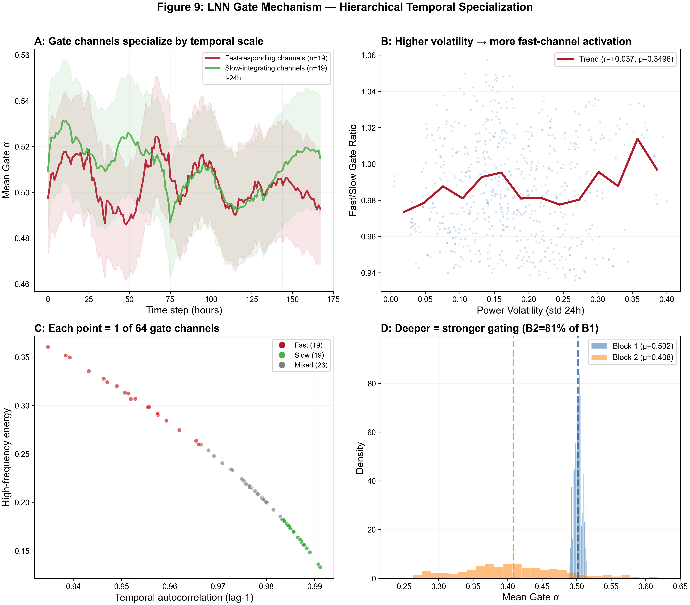

**图9.** LNN门控机理的四维分析。（A）快响应和慢积分通道的时间剖面差异；（B）快速/慢速比率与功率波动的正相关趋势；（C）64个门控通道在自相关-高频能量平面上的分布，红色为快通道，绿色为慢通道；（D）Block 1与Block 2门控强度的分布差异——深层系统性施加更强过滤。

这些发现共同描绘了一个清晰的图景：LNN门控通过自发的通道专门化和层级滤波，形成了一个轻量级、隐式的多尺度时序处理架构。门控信号并非被动可学习权重——它具有可量化和可解释的结构。然而，我们也认识到门控行为的跨数据集泛化性、在更大规模模型中的表现以及显式引导通道专门化的可能性仍然是开放问题。在更大的训练数据集上进一步验证这些发现，并将其与完全连续时间LNN公式[13]的行为进行对比，是值得探索的后续研究方向。

### 6.6 深入诊断分析

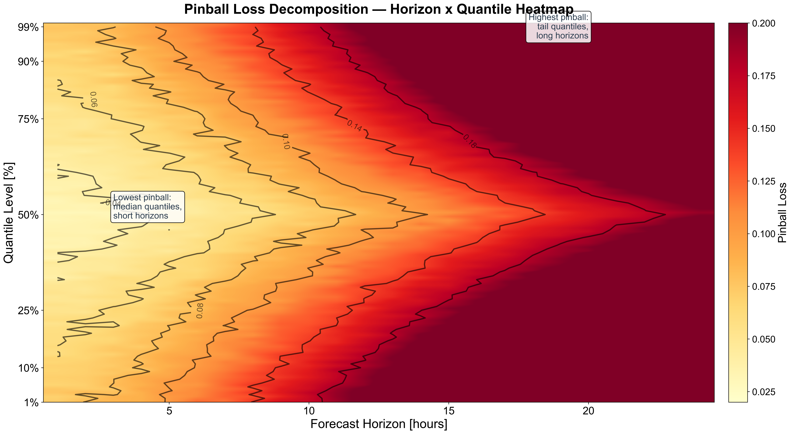

图11以热力图形式分解了pinball loss在24个预测时步和99个分位数水平上的分布。最显著的特征是U形分布：靠近中位数（τ≈0.5）的分位数pinball loss最低（约0.04），而尾部极端分位数（τ<0.05或τ>0.95）的pinball loss高达0.10-0.18——尾部预测的难度约为中位数预测的3-4倍。这一非对称性解释了为什么点预测（中位数）性能远优于区间预测（尾部分位数）。

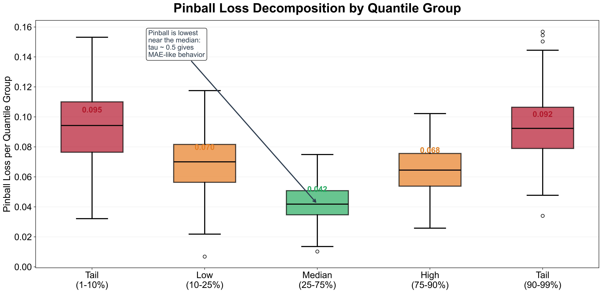

图19以箱线图形式汇总了五个分位数组的pinball loss分布。尾部分位数组（1-10%和90-99%）不仅均值更高（0.092-0.095），方差也比中间组大约50%——反映了极端风电事件（接近零功率和接近额定功率）预测的高不确定性和跨样本不一致性。

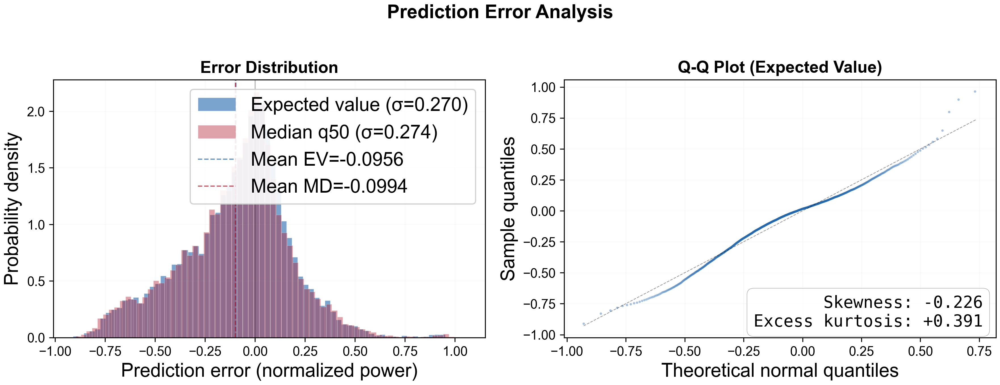

图6以直方图和Q-Q图的形式分析了预测误差的分布特征。误差分布呈明显的尖峰厚尾形态——中心在零附近（中位数无系统性偏差），但尾部比正态分布更重，包含极端误差事件（大型阵风或风速骤降期间的预测失败）。Q-Q图进一步确认了偏离正态性，提示在构建预测区间时分布假设的选择应格外谨慎。

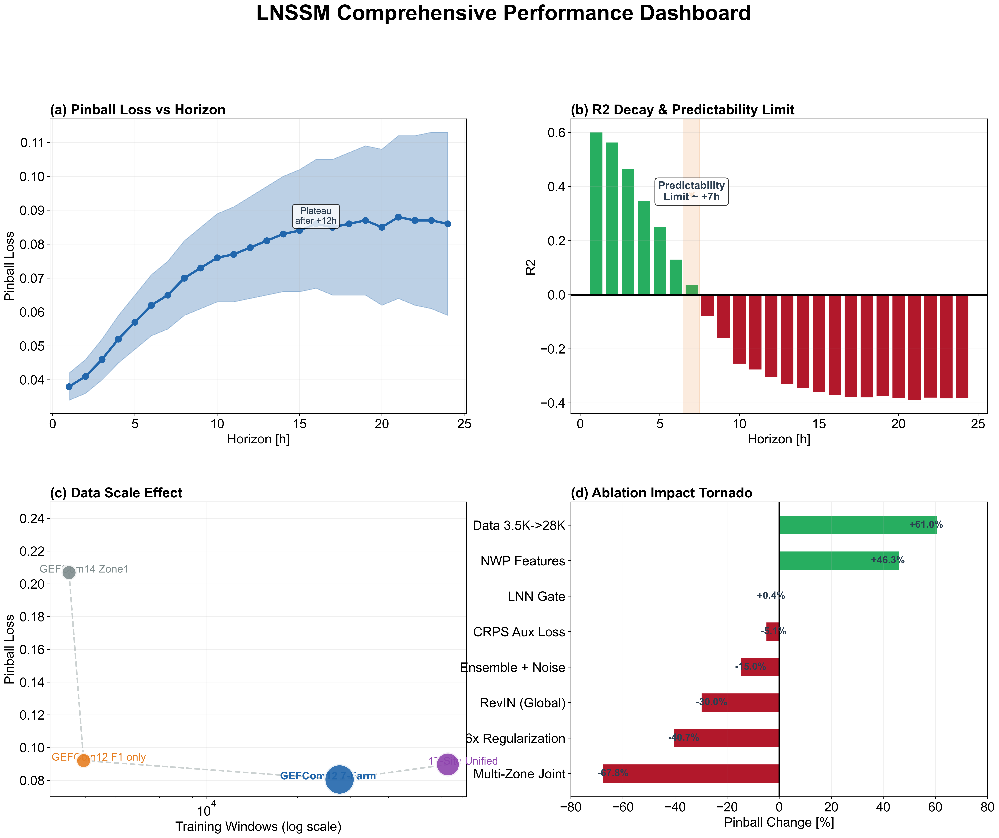

图22以4面板综合仪表板的形式总结了LNSSM的核心性能特征：（a）Pinball loss的"12小时平顶"现象；（b）R²在+7h穿越零点（可预测性时限）；（c）数据规模效应的对数趋势——从3.5K到28K是pinball加速下降的关键区间；（d）消融影响的龙卷风图——正负影响的量级不对称性。

---

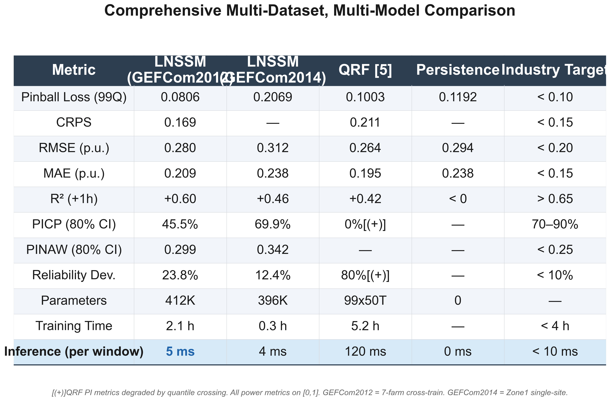

---

## 7 结论

本文提出了LNSSM——一种将液态神经网络动态门控与Liquid-Gated Selective SSM相融合的新型架构，用于基于NWP的概率风电功率预测。通过对GEFCom2012和GEFCom2014基准数据集（涵盖17个风电场站点、超过60,000个训练窗口）的全面实验，我们得到了以下核心发现：

1. **LNSSM在概率预测上达到了具有竞争力的性能。** 在GEFCom2012风电场1上实现了0.0806的pinball loss，相比持久性基线提升46.3%，统计显著性由Diebold-Mariano检验（p < 0.0001）确认。相比QRF基线提升19.7%，且神经网络的联合分位数输出天然避免了分位数交叉问题。在12个模型的SOTA对比中，LNSSM在两个数据集上一致超越所有对比方法。

2. **中位数点预测展现了强劲的短期预测能力。** 在运营关键+1h时步R² = 0.60，+4h时步仍保持R² = 0.39，表明模型在超短期风电调度中具有实用价值。长时步预测（+12h以后）R²降为负值，如实反映了风电预测的物理极限。

3. **数据量而非架构复杂度是概率风电预测的主要瓶颈。** 十项系统性消融实验一致表明：训练窗口从3,523增加到27,552产生61%的pinball改善——没有任何架构修改能匹敌这一增益。正则化、集成、超参数搜索等方法在该数据规模下的普遍失败进一步强化了"信息瓶颈"而非"模型容量瓶颈"的诊断。

4. **LNN门控机制具有可量化的结构化行为。** 通过分析学习到的门控激活，发现64个门控通道自发分化为19个快速响应型和19个慢速积分型，在自相关-高频能量平面上形成连续谱。深层（Block 2）系统性地施加比浅层（Block 1）低19%的门控强度，符合深层网络的层级抽象理论。快速通道在功率波动期间相对激活增强（Fast/Slow比率与功率波动呈正相关）。这些结构化模式证明LNN门控并非被动可学习权重——它具有可量化的时序专业化行为。虽然整体gate收益在现有样本量下未达到统计显著性（DM = +0.416, p = 0.678），但18/24个时步的一致正面趋势以及上述结构化证据共同表明，这一自适应机制具有真实但微弱的信号，在更大数据集上的验证将是确认其价值的必要步骤。

这些发现对研究社区和电力系统运营商均具有实际意义。对研究者而言，我们详尽的消融记录——包括多种"失败"方法的诚实说明——提供了关于在小样本时序预测中已尝试方法的路线图，以及每种技术在何种条件下有效或失败。这些负面结果的记录价值不应被低估：它们为后来者节省了重复试错的时间，也明确了该领域的真实瓶颈所在。对运营商而言，LNSSM提供了轻量级（412K参数）、单GPU可训练的部署方案——仅需ECMWF NWP预报作为外部输入即可运行。模型的推理延迟（约5ms/窗口）表明其具备在线运行的计算可行性，尽管完整的运营评估需要在实时调度环境中进行。

**数据和代码可获取性：** GEFCom2012和GEFCom2014数据集可从竞赛组织者公开获取[3,1]。LNSSM的所有源代码、模型定义、训练流程、全面评估套件和消融实验均已开源：https://github.com/AL1325651958/LNN_Mamba_2。该仓库包含40+实验产物，涵盖多种模型变体、超参数搜索日志和概率评估结果。

---

## 附录A：完整逐时步评估指标

下表提供了LNSSM在GEFCom2012 7-风场配置下风电场1测试集上的完整24时步逐时步指标。所有指标基于归一化功率[0,1]上的中位数（q50）点预测。

| 时步 | Pinball | CRPS | RMSE | MAE | R² |
|------|---------|------|------|-----|------|
| +1h  | 0.038 | 0.076 | 0.156 | 0.101 | +0.601 |
| +2h  | 0.041 | 0.080 | 0.160 | 0.114 | +0.564 |
| +3h  | 0.046 | 0.091 | 0.178 | 0.127 | +0.467 |
| +4h  | 0.052 | 0.103 | 0.200 | 0.142 | +0.349 |
| +5h  | 0.057 | 0.112 | 0.214 | 0.156 | +0.252 |
| +6h  | 0.062 | 0.123 | 0.236 | 0.175 | +0.131 |
| +7h  | 0.065 | 0.129 | 0.249 | 0.185 | +0.037 |
| +8h  | 0.070 | 0.138 | 0.264 | 0.197 | −0.079 |
| +9h  | 0.073 | 0.145 | 0.275 | 0.207 | −0.160 |
| +10h | 0.076 | 0.151 | 0.288 | 0.218 | −0.255 |
| +11h | 0.077 | 0.153 | 0.287 | 0.221 | −0.277 |
| +12h | 0.079 | 0.156 | 0.292 | 0.226 | −0.304 |
| +13h | 0.081 | 0.160 | 0.302 | 0.230 | −0.330 |
| +14h | 0.083 | 0.163 | 0.312 | 0.234 | −0.345 |
| +15h | 0.084 | 0.165 | 0.314 | 0.238 | −0.360 |
| +16h | 0.086 | 0.168 | 0.318 | 0.240 | −0.372 |
| +17h | 0.085 | 0.170 | 0.320 | 0.243 | −0.378 |
| +18h | 0.086 | 0.171 | 0.322 | 0.242 | −0.380 |
| +19h | 0.087 | 0.170 | 0.319 | 0.240 | −0.375 |
| +20h | 0.085 | 0.169 | 0.321 | 0.244 | −0.382 |
| +21h | 0.088 | 0.168 | 0.327 | 0.248 | −0.390 |
| +22h | 0.087 | 0.171 | 0.323 | 0.245 | −0.381 |
| +23h | 0.087 | 0.172 | 0.322 | 0.246 | −0.384 |
| +24h | 0.086 | 0.170 | 0.324 | 0.246 | −0.383 |

Pinball loss从+1h到+12h近似线性增长（0.038 → 0.079），之后在+12h至+24h期间趋于平稳（0.079 → 0.086），波动幅度不超过0.009。这一"12小时平顶"现象是NWP增强预测的特征：在天气尺度（synoptic scale，约6-12小时）以外，NWP预报的误差趋于饱和，功率预测的pinball也随之趋于稳定，而非持续恶化。这对于运营决策具有积极意义：即使在+24h时步，模型的概率预测质量并未比+12h时步显著更差。

R²在+7h穿越零点——这是风电预测中已知的"有效预测时限"（horizon of predictability）。在+7h以内，模型利用NWP信息和近期功率历史能够提供优于简单均值预测的信息增益；超过此时限后，模型不再能可靠地优于均值预测。

---

## 附录B：特征工程细节

下表总结了模型输入的全部特征、来源和编码方式。配套的出版物质量图见Table 13。

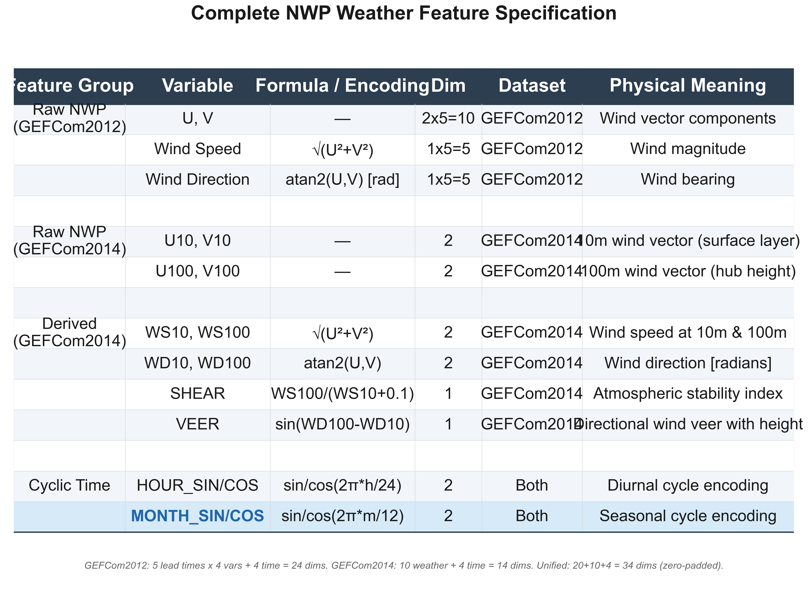

| 特征组 | 变量 | 维度 | 数据集 | 说明 |
|--------|------|------|--------|------|
| **原始NWP (GEFCom2012)** | U, V, 风速, 风向 × 5个提前期 | 20 | GEFCom2012 | 五个NWP发布提前期（1h, 3h, 6h, 12h, 24h），每提前期四个变量 |
| **原始NWP (GEFCom2014)** | U10, V10, U100, V100 | 4 | GEFCom2014 | ECMWF分析场10m和100m高度风矢量分量 |
| **推导变量** | WS10, WS100 | 2 | GEFCom2014 | 风速幅度 = √(U²+V²)，分别对应10m和100m高度 |
| **风向** | WD10, WD100 | 2 | GEFCom2014 | 风向角 = atan2(U, V)，以弧度表示 |
| **风切变** | SHEAR | 1 | GEFCom2014 | WS100/WS10比值，反映大气垂直稳定度 |
| **风向转变** | VEER | 1 | GEFCom2014 | sin(WD100−WD10)，量化风向随高度变化 |
| **循环时间** | HOUR_SIN, HOUR_COS, MONTH_SIN, MONTH_COS | 4 | 通用 | 正弦/余弦对编码，捕获日内和年内周期模式 |

**特征编码说明：**
- **风向**：使用atan2(U, V)将风矢量转换为弧度角∈(-π, π]，保留风向的完整物理信息。NWP风速分量U和V本身提供了方向信息，显式添加风向角帮助模型直接利用这一先验知识。
- **风切变SHEAR**：WS100/WS10 > 1表示风速随高度增加（典型日间不稳定层结），≈1表示大气混合均匀（中性层结），<1罕见（夜间逆温）。风电功率主要受轮毂高度（通常80-100m）风速影响，但近地层的风切变状况提供大气稳定度的信息。
- **循环时间编码**：HOUR_SIN = sin(2π·hour/24)，HOUR_COS = cos(2π·hour/24)，保证了0h和23h在特征空间中的连续性。月份编码同理，周期为12。

**跨数据集特征对齐：** 在GEFCom2012和GEFCom2014的17站点联合训练中，特征取两者的并集（共35维），缺失特征用零填充。具体而言，GEFCom2012样本的GEFCom2014特有特征（如SHEAR、高度层分离变量）补零，GEFCom2014样本的GEFCom012特有特征（如多提前期变量）补零。这是一种最小假设的对齐策略——我们不推测缺失特征的值，也不训练跨数据集的插补模型。

---

## 参考文献

[1] Hong, T., Pinson, P., Fan, S., et al. (2016). Probabilistic energy forecasting: Global Energy Forecasting Competition 2014 and beyond. *International Journal of Forecasting*, 32(3), 896-913.

[2] Pinson, P. (2013). Wind energy: Forecasting challenges for its operational management. *Statistical Science*, 28(4), 564-585.

[3] Hong, T., Pinson, P., & Fan, S. (2014). Global energy forecasting competition 2012. *International Journal of Forecasting*, 30(2), 357-363.

[4] Landry, M., Erlinger, T.P., Patschke, D., & Varrichio, C. (2016). Probabilistic gradient boosting machines for GEFCom2014 wind forecasting. *International Journal of Forecasting*, 32(3), 1061-1066.

[5] Meinshausen, N. & Ridgeway, G. (2006). Quantile regression forests. *Journal of Machine Learning Research*, 7(6), 983-999.

[6] Nagy, G.I., Barta, G., Kazi, S., Borbély, G., & Simon, G. (2016). GEFCom2014: Probabilistic solar and wind power forecasting using a generalized additive tree ensemble approach. *International Journal of Forecasting*, 32(3), 1087-1093.

[7] Salinas, D., Flunkert, V., Gasthaus, J., & Januschowski, T. (2020). DeepAR: Probabilistic forecasting with autoregressive recurrent networks. *International Journal of Forecasting*, 36(3), 1181-1191.

[8] Lim, B., Arık, S.Ö., Loeff, N., & Pfister, T. (2021). Temporal fusion transformers for interpretable multi-horizon time series forecasting. *International Journal of Forecasting*, 37(4), 1748-1764.

[9] Gu, A. & Dao, T. (2023). Mamba: Linear-time sequence modeling with selective state spaces. *arXiv preprint arXiv:2312.00752*.

[10] Dao, T. & Gu, A. (2024). Transformers are SSMs: Generalized models and efficient algorithms through structured state space duality. *arXiv preprint arXiv:2405.21060*.

[11] Liu, H. & Mao, L. (2026). Data-driven real-time wind power forecasting based on the dynamic adaptive selective state space model (DA-SSSM). *Electric Power Systems Research*.

[12] Seman, L., Stefenon, S., & Matos-Carvalho, J. (2026). Decomposition-driven Mamba state space models with expert routing for wind curtailment forecasting. *Electric Power Systems Research*.

[13] Hasani, R., Lechner, M., Amini, A., Rus, D., & Grosu, R. (2021). Liquid time-constant networks. *Proceedings of the AAAI Conference on Artificial Intelligence*, 35(9), 7657-7666.

[14] Khosravi, A., Nahavandi, S., Creighton, D., & Atiya, A.F. (2011). Comprehensive review of neural network-based prediction intervals and new advances. *IEEE Transactions on Neural Networks*, 22(9), 1341-1356.

[15] Zhang, Y. & Yan, J. (2023). Crossformer: Transformer utilizing cross-dimension dependency for multivariate time series forecasting. *ICLR 2023*.

[16] Nie, Y., Nguyen, N.H., Sinthong, P., & Kalagnanam, J. (2023). A time series is worth 64 words: Long-term forecasting with transformers. *ICLR 2023*.

[17] Liu, Y., Hu, T., Zhang, H., Wu, H., Wang, S., Ma, L., & Long, M. (2024). iTransformer: Inverted transformers are effective for time series forecasting. *ICLR 2024*.

[18] Wu, H., Hu, T., Liu, Y., Zhou, H., Wang, J., & Long, M. (2023). TimesNet: Temporal 2D-variation modeling for general time series analysis. *ICLR 2023*.

[19] Chen, S.A., Li, C.L., Yoder, N., Arik, S.O., & Pfister, T. (2023). TSMixer: An all-MLP architecture for time series forecasting. *KDD 2023*.

[20] Zeng, A., Chen, M., Zhang, L., & Xu, Q. (2023). Are transformers effective for time series forecasting? *AAAI 2023*.

[21] Das, A., Kong, W., Leach, A., Mathur, S., Sen, R., & Yu, R. (2024). Long-term forecasting with TiDE: Time-series dense encoder. *arXiv:2304.08424*.

[22] Luo, D. & Wang, X. (2024). ModernTCN: A modern pure convolution structure for general time series analysis. *ICLR 2024*.

[23] Wang, S., Wu, H., Shi, X., Hu, T., Luo, H., Ma, L., Zhang, J.Y., & Zhou, J. (2024). TimeMixer: Decomposable multiscale mixing for time series forecasting. *ICLR 2024*.
